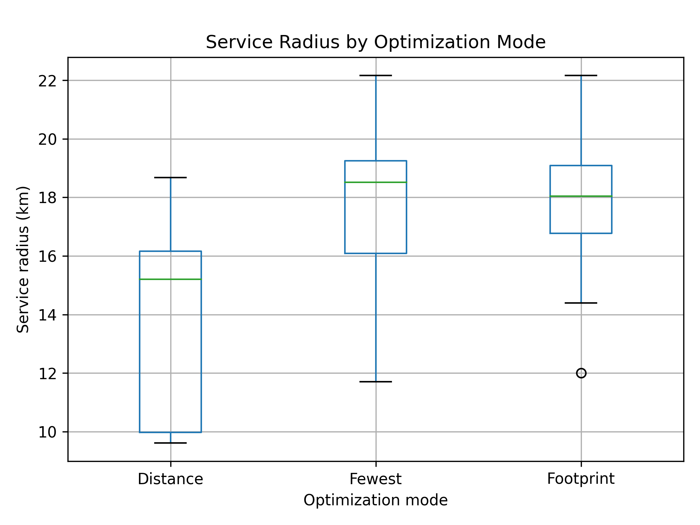
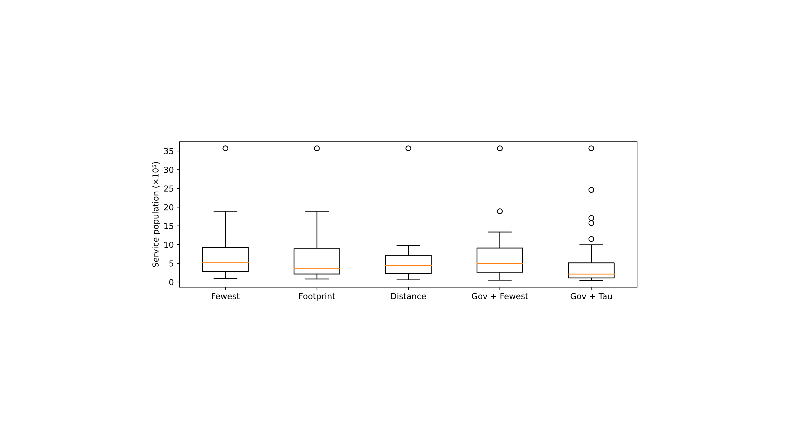
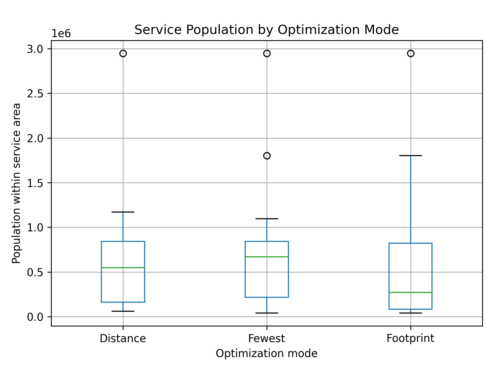

<!-- _class: lead -->

# Delineating Hospital Service Areas in Data-Scarce Settings
## Theory, Algorithm, and Validation

**Webinar 1 of 3 — 90 minutes**

*Zaslavsky et al., GeoHealth (in review)*

<!--
Welcome, everyone. This is the first of three webinars on Hospital Service Area delineation and climate-health analysis in Jordan. My name is Ilya Zaslavsky and over the next ninety minutes we are going to cover the theoretical foundations: what HSAs are, why the standard methods fail in low- and middle-income countries, and how our optimization algorithm works.

I want to start by telling you what problem we are actually trying to solve. In the United States, the Dartmouth Atlas project drew hospital service area boundaries by asking where Medicare patients went for care — you take all the ZIP codes, find the hospital that attracted the plurality of patients from each ZIP code, and that is your HSA. Clean and defensible. The problem is that this method requires individual patient origin data linked to providers, and that data simply does not exist in a machine-readable form in most of the world.

Jordan is a good example. We have a national infectious disease surveillance network covering a hundred and eighty-eight facilities. We have GPS coordinates for every facility. We have WorldPop population grids. We have patient visit records — but those records tell us which facility a patient visited, not where the patient came from. So we need a method that works from the supply side rather than the demand side.

This webinar is organized in six sections. We start with what HSAs are and why they matter. We then walk through what is wrong with the standard alternatives — fixed-radius buffers and Voronoi tessellation. The core section describes our optimization algorithm in detail: the adaptive radii, the multi-objective score, and the five operating modes. We then cover the post-greedy quality control steps introduced in version seven of the algorithm. We compare against baseline methods. And we finish with limitations and open questions. Questions are welcome throughout — please use the chat.
-->

---

## Agenda

- Why HSAs matter for health systems analysis
- What existing methods get wrong in LMICs
- The optimization framework: objectives, constraints, algorithm
- Post-greedy anchor quality control (v7 and v8)
- Comparison with fixed-radius and Voronoi alternatives
- Limitations and future directions

<!--
Before we dive in, let me give you the big picture of why any of this matters. Health systems analysis depends on having stable, meaningful geographic units. If you want to measure whether diarrheal disease rates are higher in areas with poor sanitation, you need to aggregate cases to some spatial unit, attach that unit's sanitation score, and then do the comparison. The unit has to be large enough to have stable case counts but small enough to reflect real geographic variation in risk factors.

Administrative boundaries — governorates, districts — are the obvious choice, but they were drawn for political reasons and rarely align with how people actually seek healthcare. A Jordanian governorate can contain 50 to 200 facilities and span a population range from 50,000 to 3 million. That heterogeneity swamps any real epidemiological signal.

The Dartmouth Atlas HSAs are purpose-built for this problem in the US context, but as I mentioned, they require data we don't have. So we built our own method. This series of three webinars covers the full technical pipeline — from delineating the HSAs through extracting climate data from Google Earth Engine through fitting distributed lag non-linear models. This first session is purely about the delineation methodology. Sessions two and three cover the implementation and the epidemiological modeling.

I'd also note that all the code we discuss is publicly available. The repository is called jordan-hsa-optimization-v2 and it contains synthetic data that mirrors the statistical structure of the real surveillance data, so you can run everything yourself without needing access to patient records.
-->

---

## What Is a Hospital Service Area?

An HSA is a geographic unit representing the primary catchment of one or more healthcare facilities.

HSAs serve three purposes in health research:

- **Epidemiological surveillance**: aggregate disease cases to a stable geographic unit
- **Health equity analysis**: compare access, utilization rates, and disease burden across regions
- **Environmental health**: link climate and environmental exposures to health outcomes at appropriate spatial scales

The classic US definition (Dartmouth Atlas, 1996) derives HSAs from Medicare claims: draw a boundary around the plurality of patients for each hospital. That requires individual patient origin data.

<!--
Let me define terms precisely. A Hospital Service Area is a geographic polygon that represents the area from which a healthcare facility or cluster of facilities draws most of its patients. The key word is "most" — not all, because patients do cross boundaries, especially for specialized care, but the polygon captures the primary catchment.

For epidemiological surveillance the HSA serves as the unit of aggregation. Instead of reporting that hospital X had forty cases of diarrheal disease last week, you report that HSA number seven had forty cases — and you attach that HSA's climate, population, and infrastructure characteristics to build a panel dataset suitable for regression modeling.

For health equity analysis, HSAs let you ask: is the ratio of cases to population — the disease rate — systematically higher in areas with worse infrastructure? Are large, high-capacity HSAs serving populations that are already better off? These are the kinds of equity questions that require a stable, comparable unit.

For environmental health, which is our primary application, you need a unit that is large enough to have statistically stable climate averages but small enough to capture the climate gradient across a country. Jordan spans about four hundred kilometers from north to south and has dramatic climate variation from Mediterranean highlands in the north to hyper-arid desert in the south. Averaging climate across the entire country or across a large governorate would hide the gradient that we are trying to study.

The Dartmouth Atlas definition, developed by Wennberg and Cooper in 1996, established the patient-flow standard in the US. Their method is elegant: for each ZIP code, find which hospital treats the most Medicare patients from that ZIP, and assign the ZIP to that hospital's HSA. Our method is designed to achieve similar results using only facility characteristics and population distribution, without patient travel data.
-->

---

## The LMIC Problem

In low- and middle-income countries, patient origin data are rarely available in machine-readable form.

**What is usually available:**

- Facility locations (GPS coordinates)
- Facility type and administrative capacity
- Population distribution rasters (WorldPop, GPWv4)
- Administrative boundaries

**What is not available:**

- Patient addresses or origin ZIP codes
- Individual travel routes
- Insurance claims linked to providers

Methods designed for the US context cannot be directly applied.

<!--
Let me be concrete about the data gap. In Jordan's Ministry of Health INF surveillance system, a visit record contains a date, a diagnosis code, the facility where the visit occurred, and some patient demographic fields. It does not contain the patient's home address or governorate of residence. The diagnosis is recorded at the point of care, not geolocated to the patient's origin.

This is not a Jordan-specific problem. The same limitation applies in most sub-Saharan African surveillance systems, most South and Southeast Asian national health information systems, and most of Latin America's facility-based surveillance networks. Patient origin data — the kind that supports Dartmouth Atlas-style HSA derivation — requires either a claims-based insurance system with residential addresses, a well-functioning civil registration system linked to health records, or a dedicated patient survey. None of these are routinely available.

What is available in most LMICs is the supply-side data: facility GPS coordinates, facility type and capacity, and population rasters from WorldPop or similar products. Administrative boundaries come from OpenStreetMap and national census authorities. Climate grids come from Google Earth Engine — CHIRPS for precipitation, ERA5-Land for temperature and humidity.

The methodological challenge is to go from that input set to something that behaves like a Dartmouth HSA — geographically coherent, epidemiologically appropriate, and free of double-counting — without the patient origin data that the Dartmouth method depends on. The rest of this webinar describes how we solve that problem.
-->

---

## Why Not Just Use Fixed-Radius Buffers?

The intuitive fallback: draw a 15 km circle around each facility. Problems:

| Metric | Fixed 15 km (all facilities) | Optimized HSA |
|--------|-------------------------------|---------------|
| Spatial units | 184 | 17 |
| Coverage multiplier | 24.5× | 1.31× |
| Usable for disease rates | No | Yes |

A 24.5× multiplier means each person is counted in 24 facilities on average. Disease rates computed from fixed-radius denominators are meaningless.

Fixed buffers also ignore facility capacity, patient volume, and geographic accessibility.

<!--
The most common shortcut in LMIC health geography is the fixed-radius buffer: draw a circle of some fixed distance — typically 5, 10, or 15 kilometers — around every facility, and call each circle a catchment area. This is easy to implement in any GIS and requires no optimization.

The problem is immediately obvious when you count the overlap. For Jordan's INF network with 188 facilities, a 15-kilometer radius buffer around every facility produces a total covered area that represents 24.5 times the actual population of Jordan. That is not a coverage statistic — it is a measure of how badly the method fails. The same person is inside the radius of roughly 24 different facilities on average.

When you try to compute a disease rate for facility X using this method — cases divided by population in the buffer — your denominator includes people who are much more likely to seek care at facility Y or Z. The rate is meaningless because the denominator has no connection to the actual service population.

There is a second problem even if you try to fix the double-counting. Fixed-radius buffers treat every facility identically. A primary care center with a hundred patients per year gets the same 15-kilometer circle as a regional hospital with fifty thousand patients. From a health equity and surveillance perspective, these two facilities should not be equivalent units of analysis.

And fixed buffers ignore geography. In a region with mountains, rivers, and road networks, a 15-kilometer Euclidean radius may span terrain that is effectively impassable. Our method uses population-density-adjusted radii that implicitly capture the accessibility variation across Jordan's very heterogeneous landscape.
-->

---

## Why Not Voronoi Tessellation?

Voronoi (nearest-facility) tessellation partitions space without overlap — but:

- Assigns every pixel to the nearest facility regardless of capacity
- Produces 154 units for 154 INF facilities; too fine for surveillance
- Spatial concordance with clinically meaningful catchments: 10.4%
- Compactness: 0.655 (highly irregular shapes)

Neither method selects which facilities should anchor population aggregation units.

<!--
The second obvious alternative is Voronoi tessellation, also called Thiessen polygons or nearest-facility allocation. In this approach, every point in space is assigned to the nearest facility. There is no overlap by construction — each pixel belongs to exactly one facility — and coverage is complete.

Voronoi sounds attractive because it solves the double-counting problem. But it creates three serious problems of its own.

First, it treats all facilities identically in terms of size. The nearest facility to a given population cell may be a small clinic that sees twenty patients per week and has no inpatient capacity. That clinic becomes the anchor for potentially tens of thousands of people who realistically would travel further to a larger hospital for most care.

Second, for our network of 188 facilities, Voronoi produces 188 spatial units. That is too fine for disease surveillance. A small clinic's catchment might have an expected count of two or three diarrheal cases per week — not enough statistical power to detect any climate signal. Good surveillance units need populations of at least 200,000 to 300,000.

Third, and most telling: we computed the spatial concordance between Voronoi catchments and our optimized HSAs. The overlap is only 10.4 percent of area. Voronoi and optimized HSAs are measuring almost entirely different things, because Voronoi ignores the facility selection problem entirely.

The compactness score of 0.655 reflects that Voronoi polygons are highly irregular — elongated, angular, and sensitive to the precise location of individual facilities. For environmental exposure aggregation, this irregularity adds noise without adding information.
-->

---

## The Core Insight

Not all facilities should be HSA anchors.

A primary care clinic serving 200 patients should not be an independent surveillance unit. A regional hospital serving 50,000 patients should be.

**HSA delineation is a facility selection problem** with two coupled objectives:

1. Select a small set of anchor facilities that collectively cover the target population
2. Delineate service area boundaries that minimize overlap and reflect travel accessibility

The optimization must balance these objectives against each other, across varying urban–rural geographies, without patient origin data.


<!--
The key reframe that makes our approach work is to recognize that HSA delineation is fundamentally a facility selection problem. Not every facility should be an HSA anchor — an independent geographic unit for surveillance and analysis. The question is: which subset of facilities, each anchoring its own service area, collectively provides the best coverage of the population with the least redundancy?

The pipeline diagram on this slide shows the full architecture. Inputs come from four sources: WorldPop for gridded population, facility coordinates and volumes from the Ministry of Health, administrative boundaries from OpenStreetMap, and hydromet grids from Google Earth Engine. The optimization step takes all of that and selects a small set of anchor facilities using a multi-objective greedy algorithm. Post-processing then handles the overlap between selected HSAs and produces the final boundary polygons.

The two coupled objectives are coverage and parsimony. You want to cover as much of the population as possible — ideally 90 percent or more — while using as few anchor facilities as possible, since each additional anchor adds complexity to downstream analysis. These objectives conflict: you can always increase coverage by adding more anchors, and you can always reduce anchor count by accepting lower coverage.

Between those extremes, there is a Pareto frontier of solutions. Our algorithm explores that frontier through five optimization modes that place different weights on coverage, distance, and geographic constraints. Downstream users pick the mode that best matches their analytical question — fewest anchors for administrative efficiency, distance-minimizing for access equity, or governorate-constrained for policy alignment.
-->

---

## Adaptive Service Radii

Before optimization, each facility receives an individual service radius.

**Base radius:**

- Urban facilities: 10 km
- Rural facilities: 18 km (determined by population density at facility location)

**Volume adjustment:** ±3 km scaled by patient volume relative to the network median.

High-volume facilities receive slightly larger radii; low-volume facilities receive slightly smaller radii. The range is capped to prevent very large facilities from dominating at the expense of geographic coverage.

These radii define the spatial footprint each facility *could* claim as its service area if selected.



<!--
Before the optimizer runs, every facility receives an individual service radius. This pre-computation step is important because it encodes geographic accessibility in a way that the optimizer can then use.

The base radius is determined by the local population density at the facility's location. We classify facilities as urban if they are in a cell where the population density exceeds a threshold, and rural otherwise. Urban facilities get a base radius of 10 kilometers; rural facilities get 18 kilometers. The logic is that in dense urban areas, a 10-kilometer circle is already large enough to capture a substantial population, while in rural areas — where the nearest alternative facility may be 30 or 40 kilometers away — an 18-kilometer radius is more appropriate.

On top of the base radius, we apply a volume adjustment. Facilities with patient visit counts well above the network median receive up to 3 additional kilometers; facilities well below the median lose up to 3 kilometers. The adjustment is linear in the log of the volume ratio. This means high-capacity hospitals, which realistically draw patients from farther away, get slightly larger service areas, while small clinics get tighter catchments that reflect their local character.

The radius cap prevents any single facility from claiming an implausibly large service area. A major hospital should not have a 50-kilometer radius just because it has high volume; that would make the optimization trivially select the largest hospitals and ignore geographic coverage.

These radii are conceptual — they define the maximum possible catchment if a facility is selected as an anchor. The actual boundary polygons are clipped to inhabited WorldPop cells, which often makes the effective catchment much smaller than the full radius circle, particularly in desert areas.
-->

---

## The Multi-Objective Score

At each greedy iteration, every unselected facility receives a score:

```
score = w₁·coverage_gain
      + w₂·volume_contribution
      + w₃·climate_diversity_gain
      + w₄·coverage_progress
      - w₅·overlap_penalty
      - w₆·distance_penalty
```

The facility with the highest positive score is added to the anchor set.

**Coverage gain**: population newly covered (not already covered by selected facilities).
**Overlap penalty**: population counted again by this radius (already covered).
**Distance penalty**: mean travel distance from covered pixels to this facility.
**Climate diversity**: difference from already-selected facilities' climate profiles.


<!--
The core of the algorithm is a greedy scoring function. At each iteration, every facility that has not yet been selected as an anchor receives a score, and the highest scorer is added to the anchor set. This repeats until the coverage target — typically 90 percent of the country's population — is reached.

The score has six terms. The first is coverage gain: how much new population, not already inside any selected HSA radius, falls within this facility's radius. This is the primary driver of selection in the early iterations. Large facilities in uncovered regions score very high.

The volume contribution term rewards selecting high-capacity facilities. A hospital with 50,000 annual visits should be preferred over a clinic with 500 visits even if their coverage gain is similar, because the hospital is a more defensible anchor for a surveillance unit.

The climate diversity gain rewards selecting facilities in climate environments not yet represented in the anchor set. This is the term that prevents all anchors from clustering in Amman. By including a small reward for picking up a new climate cluster, the optimizer naturally selects anchors that span Jordan's north-to-south climate gradient.

The coverage progress term is a momentum reward: facilities that help push total coverage toward the target faster get a small bonus. This prevents the algorithm from stalling on marginal gains in already-covered areas.

The overlap penalty is subtracted: population that is already covered by a selected anchor but also falls within this facility's radius counts against the score. This discourages selecting facilities whose service areas substantially overlap with already-selected anchors.

The distance penalty discourages selecting facilities that are far from the population they would serve. In the governorate-constrained modes, a cross-governorate penalty is also applied.
-->

---

## Five Optimization Modes

The same algorithm runs with different objective weights, producing different trade-offs:

| Mode | Priority |
|------|----------|
| `fewest` | Minimize anchor count; maximize coverage per anchor |
| `footprint` | Balance coverage and overlap; general-purpose |
| `distance` | Minimize travel distance; maximizes access equity |
| `governorate_fewest` | At least one anchor per governorate |
| `governorate_tau_coverage` | Governorate-constrained with coverage threshold τ |



<!--
The same algorithm with different objective weights produces five distinct operating modes, each suited to a different analytical question.

The fewest mode maximizes coverage per anchor. It places the highest weight on coverage gain and essentially asks: what is the smallest set of facilities that covers 90 percent of the population? This mode produces the most parsimonious solution and typically selects the largest hospitals in the most densely populated areas.

The footprint mode is our general-purpose default. It balances coverage gain, overlap penalty, and climate diversity roughly equally. In downstream modeling, the footprint mode produces HSAs with reasonable population sizes — not too large, not too small — and good geographic spread.

The distance mode places high weight on the distance penalty. It prefers nearby facilities even if that means selecting more of them. The result is smaller, more locally contained HSAs that minimize the mean travel distance from population to anchor. This mode is most relevant for access equity analysis.

The governorate modes add a hard constraint: at least one anchor must be selected per governorate, regardless of whether the optimizer would have selected one on purely coverage grounds. This is appropriate for applications where national health policy is implemented at the governorate level and each unit needs its own anchor.

The box plot on this slide shows the distribution of service populations — the allocated population assigned to each HSA — across the five modes. You can see that the fewest mode produces HSAs with the widest population spread: some very large HSAs and some small ones. The governorate-tau mode, by requiring at least one anchor per governorate, produces more evenly distributed service populations but at the cost of more anchors in rural governorates.
-->

---

## Greedy Selection: Illustrated

```
Iteration 1:
  Select facility with highest score → Al-Basheer Hospital (Amman)
  Covers ~3.2M population (31% of Jordan)

Iteration 2:
  Select next best → AL-Zarqa Hospital
  Adds ~1.1M (not already covered)
  Overlap penalty applied where radii intersect

...

Iteration 17:
  Coverage target reached (90%)
  Stop
```

The algorithm takes ~0.3 seconds per iteration. Five modes × 17 anchors = 85 scoring calculations per run.


<!--
Let me walk through what the greedy selection actually looks like in practice for the INF footprint mode.

At iteration one, every facility is unselected and every part of Jordan is uncovered. Al-Basheer Hospital in Amman scores highest because it has the largest patient volume in the network — about 750,000 attributed patients — sits in the densest part of Jordan's urban core, and its 10-kilometer radius immediately covers roughly 3.2 million people, which is about 31 percent of Jordan's population of 10.2 million. There is no overlap penalty because nothing else has been selected yet.

At iteration two, the large hospitals near Amman score high but now face an overlap penalty because Al-Basheer's radius already covers much of the central region. AL-Zarqa Hospital, east of Amman, scores well because it covers a population band that Al-Basheer does not reach — about 1.1 million additional people — and its climate profile is slightly different from Amman's.

This continues through roughly 15 to 17 iterations, with the algorithm moving progressively into less-covered regions: northern Jordan, the Karak and Tafilah governorates in the south, then the Aqaba coast and the eastern badia. The coverage progresses roughly logarithmically — the first few facilities cover large fractions, later ones cover smaller incremental populations.

At iteration 17, coverage crosses 90 percent and the algorithm stops. Total runtime for all five modes is about 30 seconds on a standard laptop. The full HSA_FINAL.ipynb notebook, which runs five modes times three algorithm variants, takes roughly 8 to 12 minutes because it also handles the post-greedy correction steps and the boundary construction.
-->

---

## The Greedy Limitation

Greedy algorithms are myopic: each selection is locally optimal at the time of selection.

Two failure modes are known in this problem:

**Failure 1 — Weak anchor selection**: The greedy step selects a small primary center because it provides marginal coverage gain or climate diversity. A much larger hospital lies within the same service radius but was not considered at that iteration.

**Failure 2 — Major-facility orphaning**: A large regional hospital is not selected because the coverage target was reached before reaching its area. The default fallback (nearest selected anchor) may assign it to a small or distant facility — a clinically implausible result.

Both failures occurred in the INF-FOOTPRINT run on Jordan data, particularly for southern facilities.

<!--
Greedy algorithms have a well-known limitation: they are myopic. At each iteration, the algorithm picks the best available facility given the current state. It has no lookahead, no ability to reconsider past selections, and no mechanism to detect that a chosen anchor is dominated by a nearby better option that became relevant only later in the process.

This limitation produced two concrete failures when we first ran the algorithm on Jordan's INF network.

The first failure was weak anchor selection. In the southern Jordan region, the greedy optimizer selected Bsaira Comprehensive Center as an anchor because at that iteration it provided marginal coverage gain in a partially uncovered area. Bsaira is a small facility with about 160 annual diagnosis records. Tafilah Governmental Hospital, which is 12 kilometers away in the same area, has 658 records — four times the volume — and is a proper hospital rather than a comprehensive center. The optimizer never had an opportunity to prefer Tafilah, because by the time it reached that geographic area, Bsaira's marginal contribution was sufficient to earn selection.

The second failure was major-facility orphaning. Maan Hospital and Queen Rania Hospital in Ma'an governorate are large regional hospitals with 4,500 and 1,500 annual records respectively. The coverage target was reached before the algorithm got to southern Jordan, so neither facility was selected as an anchor. Under the original nearest-anchor fallback rule, both would have been assigned to Tafilah Governmental Hospital — which is 65 to 73 kilometers away and in a different governorate. That assignment is clinically implausible; patients in Ma'an do not travel to Tafilah for routine care.

Version 7 of the algorithm adds two deterministic post-selection corrections to handle exactly these two failure modes.
-->

---

## v7: Anchor Upgrade / Demotion

After greedy selection, v7 checks each selected anchor against nearby unselected facilities.

**Replacement is applied when:**

- An unselected facility lies within the selected anchor's service radius
- It is in the same governorate (when metadata is available)
- Its patient volume is at least 2× larger, or it is a higher facility type
- The volume gain is at least 100 diagnosis records

The weaker facility is *demoted* to a regular facility (still allocatable). The stronger facility inherits the original anchor's service radius and optimization metadata.

**Five replacements in INF-FOOTPRINT:**

| Demoted anchor | New anchor | Volume ratio |
|----------------|------------|-------------|
| Bsaira Comprehensive Center | Tafilah Governmental Hospital | 4.09× |
| North Madaba Comprehensive Center | AL-Nadeem Hospital | 4.85× |
| Jadaa Primary Center | Faqqou Comprehensive Center | 75.1× |


<!--
The anchor upgrade step is the first of v7's two post-greedy corrections. After the greedy algorithm finishes and the anchor set is fixed, v7 examines every selected anchor and asks: is there a stronger facility nearby that the greedy process should have chosen instead?

The search is local. We only look within the selected anchor's own service radius — we are not proposing to restructure the entire HSA network. Within that radius, we look for unselected facilities that meet four conditions. First, they must be in the same governorate — we do not want to replace a local anchor with one from across a political boundary. Second, the candidate must have higher patient volume than the selected anchor. Third, the volume gain must be at least 100 records, to avoid replacing one small facility with another marginally larger one. Fourth, the candidate must be either a higher facility type — hospital versus comprehensive center versus primary center — or at least twice the volume.

When a replacement is found, the selected anchor is demoted. It is not removed from the system — it remains available for patient allocation and can still attract population in the gravity model — but it loses anchor status. The stronger facility takes over as the anchor, inheriting the original facility's service radius and greedy-optimization metadata. This inheritance is important: we do not want the correction step to accidentally expand the service area of the replacement facility beyond what the optimizer intended.

In the INF footprint run, five replacements were made. The most important is the Bsaira-to-Tafilah correction, which resolves the failure I described on the previous slide. The Jadaa-to-Faqqou replacement is even more dramatic: the original anchor had only 9 annual records; the replacement has 676, a ratio of 75 to 1.
-->

---

## v7: Major-Orphan Promotion

After anchor upgrades, v7 checks whether any major facility is uncovered without a plausible fallback.

**A major facility is any hospital or facility above the 80th volume percentile.**

**Plausible fallback requires:**

- Distance ≤ min(100 km, max(1.5 × nearest anchor radius, 30 km))
- Same-governorate anchor for major facilities

If no plausible fallback exists, the facility is promoted to an anchor.

**Two promotions in INF-FOOTPRINT:**

| Promoted facility | Volume | Nearest prior anchor | Distance | Cross-governorate |
|-------------------|--------|----------------------|----------|-------------------|
| Maan Hospital | 4,534 | Tafilah Gov. Hospital | 72.6 km | Yes |
| Queen Rania Hospital | 1,512 | Tafilah Gov. Hospital | 64.6 km | Yes |

Result: 19 anchors instead of 17 in the southern anchor set.

<!--
The second post-greedy correction addresses the major-facility orphan problem. After the anchor upgrade step, we check every non-selected facility to see whether it is a major facility and whether it has a clinically plausible fallback.

A major facility is defined as any hospital, or any facility above the 80th percentile of patient volume in the network. This threshold is intentionally permissive — we want to catch all facilities that are large enough to matter epidemiologically.

Plausibility of a fallback is assessed by distance and governorate. For a given non-selected facility, we find the nearest selected anchor and compute a fallback limit. The limit is the minimum of 100 kilometers and the maximum of one-and-a-half times the anchor's service radius and 30 kilometers. For major facilities, we also require that the fallback anchor be in the same governorate, unless the nearest cross-governorate anchor is within 30 kilometers.

If no anchor passes all these tests, the facility is promoted to anchor status. It gets a default service radius based on its urban-rural classification and volume.

In the INF footprint run, two promotions were made: Maan Hospital and Queen Rania Hospital in Ma'an governorate. Both are major hospitals — Maan is the fifth-largest facility in the network by volume. Their nearest anchor after the upgrade step was Tafilah Governmental Hospital, which is 65 to 73 kilometers away and in a different governorate. No anchor in Ma'an governorate existed before the promotion. The fallback limit for Tafilah, at 30 kilometers, is far too short to reach Ma'an or Queen Rania. Both facilities are therefore promoted.

The result is 19 anchors in the INF footprint mode, up from 17 in the original manuscript version. Two new anchors — Maan and Queen Rania — now form a distinct southern Jordan HSA cluster.
-->

---

## v8: Satellite Bubble Boundaries

v8 adds a third step after anchor upgrade and major-orphan promotion.

For each selected anchor, v8 identifies *satellite facilities*: unselected facilities that:

- Lie within or near the anchor's service radius
- Are above a minimum volume threshold
- Would improve local geographic or demographic coverage if given a small secondary catchment

Each satellite receives a smaller "bubble" radius (proportional to its volume). The HSA polygon is the union of the anchor catchment and all satellite bubbles.

This creates more complex, non-circular HSA shapes that better reflect secondary service hubs — at the cost of more complex boundary geometry.

<!--
Version 8 adds a third modification: satellite bubble boundaries. Where v7 changes which facility is the anchor but keeps the circular catchment shape, v8 changes the shape of the HSA polygon itself.

The idea comes from a real characteristic of health systems: service areas are not monolithic circles. A large hospital in a city center draws patients from the city, but there may be a secondary clinic on the city periphery that draws from a different residential neighborhood, or a specialist center in a satellite town that handles specific conditions. These secondary facilities are not large enough to merit their own independent HSA, but they do have meaningful local catchments that the anchor's circle might miss.

The v8 satellite bubble step identifies these secondary facilities for each anchor. After the v7 corrections are applied, we look at every non-selected, non-promoted facility within or near each anchor's service radius. If a facility meets a minimum volume threshold and its location would add meaningful coverage beyond the anchor's circle, it receives a small "bubble" radius proportional to its volume. The HSA polygon is then computed as the union of the anchor catchment and all satellite bubbles.

The practical effect is that v8 HSA polygons can have irregular, non-circular shapes. An HSA might look like a large circle with smaller bulges on its edges where satellite facilities sit. This better reflects the actual structure of the service network.

The trade-off is complexity. Non-circular polygons are harder to work with in downstream analysis — climate averaging is more sensitive to polygon shape, and visualizations are messier. For most purposes, v7 is the recommended default. v8 is most useful for boundary sensitivity analysis, where you want to know whether the epidemiological results change when you use more realistic polygon shapes.
-->

---

## Hardened Fallback Allocation

The patient allocation step assigns each facility to its HSA based on three cases:

| Case | Condition | Rule |
|------|-----------|------|
| 1 | Inside exactly 1 HSA radius | 100% to that HSA |
| 2 | Outside all HSA radii | Nearest *admissible* anchor only |
| 3 | Inside 2+ overlapping radii | Gravity-weighted split |

In v1, Case 2 was "nearest anchor" with no distance limit. In v2, admissibility requires:

- Distance ≤ min(100 km, max(1.5 × anchor radius, 30 km))
- Same-governorate preference for major facilities

Facilities failing admissibility are **excluded and reported**, not silently attached.

<!--
After the HSA boundaries are drawn, we need to assign every facility in the network to an HSA. Not just the 17 or 19 anchor facilities — all 188 facilities. This is the allocation step, and it uses a three-case logic.

Case 1 is simple: a facility falls inside exactly one HSA radius. It is assigned entirely to that HSA. This is the most common case and covers about 145 of the 188 INF facilities.

Case 3 handles facilities inside two or more overlapping HSA radii. These get split using the gravity model: the weight assigned to each HSA is proportional to the anchor's patient volume divided by the distance to the anchor raised to the 1.5 power. This produces a weighted allocation that reflects the relative attractiveness of each competing anchor.

Case 2 is the critical one. A facility falls outside all HSA radii — it was not selected as an anchor, and the coverage target was reached before its area was well-covered. In version 1 of the algorithm, this facility was simply assigned to the nearest anchor regardless of distance or governance logic. That rule is what caused Maan Hospital to be assigned to Bsaira Comprehensive Center in the original runs.

In version 2, Case 2 uses an admissibility check. Before assigning a facility to the nearest anchor, we verify that the nearest anchor is within the admissibility limit: the minimum of 100 kilometers and the maximum of one-and-a-half times the anchor's service radius and 30 kilometers. For major facilities, we also require a same-governorate anchor unless the nearest cross-governorate option is within 30 kilometers. If no anchor is admissible, the facility is flagged as excluded and reported in the audit table rather than being silently assigned to an implausible anchor.

In the current INF footprint run, one facility fails admissibility: Swaqa Correctional Primary, a prison clinic whose location does not fit within any anchor's admissibility limit. That is an expected edge case.
-->

---

## Gravity Model for Population Allocation

For Case 3 (overlapping HSA radii), and for pixel-to-facility allocation:

```
Attractiveness(facility_i) = Volume_i^0.75 / Distance_i^1.5

Probability(facility_i | pixel) = Attractiveness_i / Σ_j Attractiveness_j
```

Parameters (α = 0.75, β = 1.5) represent moderate volume sensitivity and moderate distance decay — calibrated to Jordan's geography and facility network.

The same gravity formula is used throughout: pixel→facility and facility→HSA. This consistency eliminates seams where different allocation rules would produce discontinuous population counts.

<!--
The gravity model underlies all the probabilistic allocation steps. The core formula is the standard Huff gravity model: attractiveness of a facility is its volume raised to a power alpha, divided by the distance raised to a power beta.

We chose alpha equals 0.75 and beta equals 1.5 based on calibration against travel patterns in Jordan. Alpha controls how strongly larger facilities attract patients over distance — a value of 0.75 means that a facility ten times larger only attracts about 5.6 times as many patients from a given point, not ten times as many. This moderate sensitivity reflects that in Jordan, patients often have limited choice and will travel to closer facilities even if farther ones are larger.

Beta equals 1.5 represents moderate distance decay. A facility twice as far attracts about 2.8 times fewer patients. A value of 2 would mean quadratic decay — much sharper sensitivity to distance, appropriate for urban settings with dense facility networks. The 1.5 value works well for Jordan's mix of urban and rural geography.

The key design decision is that we use the same formula everywhere. The first step of allocation applies it to assign each WorldPop population pixel to facilities. The second step applies it again when a facility is inside multiple overlapping HSA radii. This consistency is important: if you use different models at different steps, you can create seams where the allocated population does not add up correctly across HSA boundaries. Using the same gravity formula throughout ensures that every person is counted exactly once in the aggregate.
-->

---

## Comparison: v6 vs v7 vs v8

| Feature | v6 | v7 | v8 |
|---------|----|----|-----|
| Algorithm | Greedy only | + Anchor QC | + Satellite bubbles |
| INF anchors (footprint) | 17 | 19 | 19 |
| Anchor identity check | No | Yes | Yes |
| Major-orphan guard | No | Yes | Yes |
| Boundary shape | Circular | Circular | Non-circular |
| Recommended for? | Baseline/paper | Default | Boundary sensitivity |


*v8 bubble map: regenerate by running HSA_FINAL.ipynb — output goes to `out/INF_footprint_hsas_v8.geojson`*

<!--
The three boundary versions are produced by a single run of HSA_FINAL.ipynb. The maps on this slide show the INF footprint HSA boundaries for versions 6, 7, and 8 — left to right.

Version 6 is the greedy-only baseline. It has 17 anchors. The most visible difference from v7 in the maps is in southern Jordan: in v6, the southern part of the country is covered by a single large HSA centered on Bsaira Comprehensive Center, which extends from roughly Tafilah southward to Aqaba. This is the problematic configuration described earlier.

Version 7 breaks that southern cluster apart. With the anchor upgrade (Bsaira replaced by Tafilah Governmental Hospital) and the two major-orphan promotions (Maan and Queen Rania), you can see in the map that southern Jordan now has three distinct HSAs where v6 had one. This is the version we use for all primary modeling.

Version 8 keeps the same 19 anchors as v7 but adds satellite facility bubbles. The v8 boundary shape is non-circular: each HSA polygon is the union of the anchor's service radius circle and the bubble circles of eligible satellite facilities near the boundary. A satellite is eligible when its bubble circle intersects the anchor circle boundary — that is, when the satellite is closer than one satellite-radius beyond the anchor's edge. After the union, the combined polygon is clipped to WorldPop populated cells, so the final shape reflects only inhabited areas. At the whole-country map scale the difference from v7 is subtle, but zooming into any urban anchor you will see irregular convex extensions where satellite facilities pulled the boundary outward. The image on this slide is from an earlier pipeline run; re-run HSA_FINAL.ipynb to generate the current v8 GeoJSON with the corrected satellite selection rule.

All three versions use the same downstream infrastructure: the same patient allocation notebook, the same climate extraction notebook, the same disease count scripts. The only difference is the input GeoJSON file. In every downstream notebook, you set a BOUNDARY_VERSION parameter to v6, v7, or v8 at the top, and all file paths update accordingly.
-->

---

## Spatial Methods Comparison

| Method | Units | Coverage | Multiplier | Compactness | Surveillance-ready |
|--------|-------|----------|------------|-------------|-------------------|
| Optimized HSA (v7) | 17–19 | 90.6% | 1.31× | 0.999 | Yes |
| Fixed 10 km | 184 | 90.5% | 15.2× | 0.988 | No |
| Fixed 18 km | 184 | 96.9% | 30.9× | 0.977 | No |
| Voronoi | 154 | 99.7% | 1.0× | 0.655 | No (too fine) |
| Governorate | 12 | 99.7% | 1.0× | 0.510 | No (too coarse) |

The optimized approach is the only one that is simultaneously surveillance-ready, appropriately granular, and low-overlap.

<!--
This table summarizes the comparison across all five spatial methods. Let me walk through the four key columns.

Units: our optimized method produces 17 to 19 spatial units for the INF network. Fixed-radius methods produce 184 — one per facility — regardless of radius. Voronoi also produces 184 or 154 depending on implementation. Governorate boundaries give 12 for Jordan.

Coverage multiplier: this is the mean number of times a person is counted across all spatial units. The optimized HSA has a multiplier of 1.31 — each person falls inside about 1.3 HSA catchments on average, because service areas overlap in dense urban areas. Fixed-radius at 18 kilometers has a multiplier of 30.9. Fixed at 10 kilometers still gives 15.2. Voronoi and governorate give exactly 1.0 because they do not overlap.

Compactness: this measures how close to a perfect circle each polygon is. The optimized HSA compactness is 0.999 because every HSA is literally a circular or nearly circular catchment. Voronoi polygons score 0.655 — highly irregular. Governorate boundaries score 0.510.

Surveillance-readiness requires: no extreme overlap, a number of units between 12 and 200 but calibrated to population, and shapes that make geographic sense. The optimized HSA is the only method that passes all three criteria. Fixed-radius fails on overlap. Voronoi fails on granularity — 184 units where many have too few cases for statistical modeling. Governorate fails on granularity in the other direction — 12 units that aggregate away all local variation.
-->

---

## Validating HSA Face Validity

Face validity checks (applied informally throughout):

1. **Type check**: Are anchors hospitals or high-volume facilities, not primary centers?
2. **Geographic coverage**: Is each governorate represented?
3. **Population range**: Do HSAs avoid extreme size disparities?
4. **Named facility check**: Are well-known regional hospitals in their expected HSA?
5. **Cross-governorate check**: Are no major hospitals assigned across governorate lines?

The v7 anchor upgrade and major-orphan promotion steps formalize checks 1, 4, and 5 as automated tests run at the end of every optimization.



<!--
Beyond the quantitative metrics, we apply a set of face validity checks. These are informal but important. A method that scores well on coverage and compactness but assigns Queen Alia University Hospital to a rural comprehensive center catchment has clearly failed, even if the numbers look fine.

The five checks we run are intuitive but consequential. The type check asks whether our anchors are the kinds of facilities that clinicians and administrators would recognize as regional hubs: hospitals, large comprehensive centers, facilities with meaningful inpatient capacity. Selecting a primary center with five rooms and no emergency capability as a regional HSA anchor would undermine any downstream policy interpretation.

Geographic coverage checks that every governorate has at least one anchor. Jordan has 12 governorates, and the INF network has 19 anchors in v7. Without the governorate-constrained modes, some sparsely populated southern governorates could end up with no anchor because the coverage-focused optimizer has no reason to push into them.

The named facility check is the most visible validation. Jordan's health system has well-known regional hospitals — Al-Basheer in Amman, Al-Zarqa Hospital in Zarqa, Princess Raya in Irbid — and anyone familiar with the system has strong intuitions about where these facilities should anchor service areas. If the algorithm places one of these hospitals inside another facility's catchment, that is an immediate red flag.

The v7 anchor upgrade and promotion steps are essentially automated implementations of checks 1, 4, and 5. They formalize the intuition that strong named facilities should be anchors, not absorbed into a weaker neighbor's catchment.
-->

---

## Limitations

**Algorithm limitations:**
- Greedy selection is not globally optimal; post-hoc corrections handle the two known failure modes but not all possible suboptimal selections
- Service radii are calibrated to Jordan; transferring to other countries requires parameter review
- The algorithm requires population rasters and facility volumes; pure location-only inputs yield lower-quality results

**Data limitations:**
- Synthetic patient visits (SYNMOD) preserve statistical structure but should not be used for substantive clinical inference
- WorldPop 2020 rasters are the most recent available; demographic shifts after 2020 are not reflected

**Scope limitations:**
- Method validated on two Jordan networks; external validation in another LMIC is pending

<!--
No method is perfect, and I want to be clear about where ours falls short.

On the algorithm side: greedy selection finds a good solution but not the optimal one. The post-greedy corrections in v7 handle the two failure modes we actually observed in Jordan, but there could be other suboptimal configurations that our corrections do not catch. The proper solution would be to reformulate HSA delineation as an integer programming problem with facility-type constraints built in — that would guarantee optimality. The tradeoff is computational cost and modeling complexity. For a 188-facility network the greedy approach is fast and auditable; an integer program might take much longer and be harder to explain to stakeholders.

The radius calibration is specific to Jordan. The 10-kilometer urban base radius and 18-kilometer rural base radius were chosen based on Jordan's road network, population density, and facility distribution. Applying these values unchanged to a country with a different settlement pattern — say, a highly dispersed rural population in sub-Saharan Africa, or a densely urbanized setting in South Asia — might produce poor results. Any transfer to a new context should include a sensitivity analysis on the radius parameters.

On the data side: the SYNMOD synthetic patient data is useful for pipeline validation but not for substantive analysis. The synthetic visits are generated to match the marginal distributions of the real data — the right seasonal patterns, the right diagnosis category proportions — but the individual records are random draws and carry no clinical meaning. All figures in the paper use real patient data.

Finally, we have only validated the method in Jordan. The approach is designed to be transferable, but external validation in a second LMIC would significantly strengthen the generalizability claims.
-->

---

## Open Questions for Discussion

1. How sensitive are downstream epidemiological results to the choice of v6, v7, or v8 boundaries?
2. Can the anchor upgrade parameters (2× volume ratio, same-governorate constraint) be derived analytically rather than set empirically?
3. For networks with very high facility density (urban cores), are 10 km urban radii still appropriate?
4. Is a single gravity model parameterization (α=0.75, β=1.5) transferable across different country contexts?

<!--
I want to close with four open questions that I think are genuinely unresolved and where I am curious about the audience's perspective.

The first is the boundary sensitivity question. We have three boundary versions and we can compare their epidemiological outputs — the DLNM climate-diarrhea associations, the disease rate maps, the spatial correlation patterns. But we do not yet have a clear answer on how much those outputs differ across versions. If v6 and v7 give essentially the same DLNM estimates, that is a strong robustness result. If they diverge substantially in southern Jordan where the anchor configuration changed most, that tells us something about the limits of the greedy algorithm. We will show preliminary results in Webinar 3.

The second question is about parameter derivation. The anchor upgrade threshold — two times the volume ratio — was set empirically based on the Jordan data. Is there a principled way to derive it from network properties? In theory, you could formulate this as a dominance condition: anchor A should be replaced by B if B's expected patient catchment under any reasonable gravity model is larger than A's. That would give you a data-derived threshold rather than a tuned parameter.

The third question is about radius scaling in dense urban environments. Amman's city center has facilities every 2 to 3 kilometers. A 10-kilometer radius for every urban facility would still produce enormous overlap. Should urban facilities in very dense cores get even smaller radii — say 5 kilometers?

The fourth question is the transferability of the gravity model parameters. Alpha and beta were not formally calibrated — they were selected based on prior literature and checked against rough validity criteria. A more rigorous approach would estimate them from patient flow data where such data exists, then use those estimates as priors for settings where it does not.

I am happy to take questions now, or you can hold them for the end of the demo session in Webinar 2.
-->

---

## Summary

- HSA delineation is a facility selection + boundary construction problem
- Fixed-radius and Voronoi methods fail for LMIC surveillance due to extreme overlap or excessive fragmentation
- The greedy multi-objective algorithm selects anchors balancing coverage, overlap, volume, and climate diversity
- v7 adds two deterministic post-selection guardrails: anchor upgrade and major-orphan promotion
- v8 adds satellite bubble boundaries for non-anchor facilities
- All three variants are produced by a single notebook and selectable in all downstream steps

**Code**: `HSA_FINAL.ipynb` → produces `{NETWORK}_{MODE}_hsas_{v6|v7|v8}.geojson`

<!--
To summarize the key points from today's session.

HSA delineation is a facility selection problem. The question is not how to draw a circle around every facility — it is which small set of facilities should anchor the geographic units you will use for surveillance and analysis. That selection problem requires optimization, not just geometric operations.

Fixed-radius and Voronoi methods fail for LMIC surveillance, but they fail in opposite ways. Fixed-radius produces catastrophic double-counting that makes disease rates meaningless. Voronoi produces too many units, most of which are too small to support statistical modeling.

Our greedy algorithm resolves the selection problem by simultaneously optimizing coverage, parsimony, and climate diversity. The five operating modes let users tune the trade-off toward their specific analytical question.

Version 7 adds two post-greedy guardrails that address the two known greedy failure modes — weak anchor selection and major-facility orphaning — without changing the core optimization logic. Version 8 adds non-circular boundary shapes for boundary sensitivity analysis.

All three variants are produced in a single notebook run and are selectable in every downstream step via a single BOUNDARY_VERSION parameter. The pipeline is designed so that switching from v6 to v7 to v8 requires no code changes — just a parameter change at the top of each notebook.

In Webinar 2, we will run the full pipeline live, starting from the raw synthetic data and ending with a fitted DLNM model. See you next session.
-->

---

## Further Reading

- Dartmouth Atlas methodology: Wennberg & Cooper (1996)
- Gravity model for healthcare: Luo & Wang (2003)
- Multi-objective greedy coverage: Hochbaum (1996) approximation bounds
- WorldPop: Tatem (2017), *Scientific Data*
- CHIRPS precipitation: Funk et al. (2015)
- ERA5-Land: Muñoz-Sabater et al. (2021)

<!--
These are the key references for the methods we discussed today.

The Dartmouth Atlas paper by Wennberg and Cooper established the patient-flow definition of HSAs that we have been comparing against throughout this session. Even though we cannot replicate their method in LMICs, their conceptual framework — geographic units defined by care-seeking behavior rather than administrative boundaries — is the right target.

Luo and Wang's 2003 paper introduced the two-step floating catchment area method for healthcare accessibility, which is conceptually related to our gravity model allocation. Their work on how to properly attribute population to facility service areas is directly relevant.

Hochbaum's work on approximation bounds for greedy coverage algorithms gives the theoretical grounding for why greedy is a reasonable approach here. The standard result is that for submodular set-cover problems, greedy achieves within a factor of 1 minus 1 over e of the optimal solution — about 63 percent of the optimal. In practice, because our coverage function is nearly submodular, performance is usually much closer to optimal.

The WorldPop reference by Tatem describes the dasymetric disaggregation methodology behind the population rasters we use. It is worth reading if you plan to use WorldPop in your own work, particularly the section on uncertainty in low-density areas.

CHIRPS and ERA5-Land are the climate products we use for the daily analysis in Webinar 3. The Funk et al. and Muñoz-Sabater et al. papers describe their construction and validation.
-->
