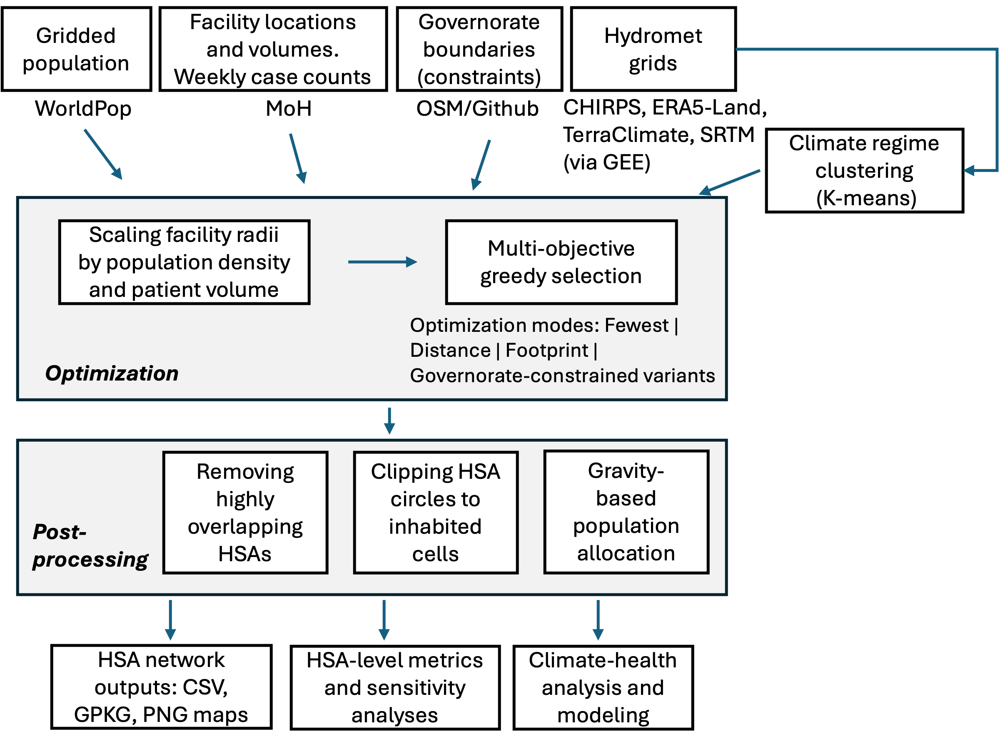
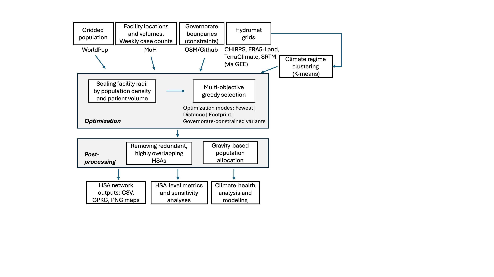
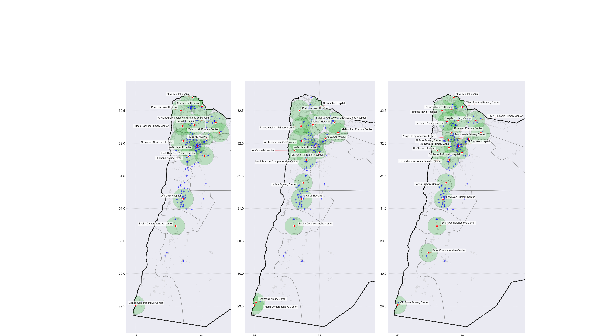

<!-- _class: lead -->

# Running the HSA Pipeline End to End
## From Raw Data to Modeled Disease Rates

**Webinar 2 of 3 — 90 minutes**

*Live demonstration with Jordan synthetic data (SYNMOD)*

<!--
Welcome to Webinar 2. Last session we covered the theory behind hospital service area delineation — the multi-objective greedy algorithm, the three boundary variants, and the reasoning behind adaptive service radii. Today we do the actual work. We open the notebooks, run them, and walk through every output file.

A few orientation notes before we dive in. Everything in this demonstration runs on the synthetic dataset — SYNMODINF patient visits — which ships in the public repository. The synthetic data preserves the temporal structure and facility volume distribution of the real INF surveillance system, but patient locations are randomly generated, so the spatial allocation results are illustrative rather than substantive. If you have access to the real dataset, the pipeline is identical; you simply point the scripts at the real patient CSV instead.

The repository you should have cloned is jordan-hsa-optimization_v2. If you have not cloned it, do that now. The URL is in the companion document. You will also need to download two WorldPop rasters from worldpop.org — the 2020 Jordan 100-meter unconstrained and constrained products. Those files are too large for git, so they are not included. Everything else you need is already in the data directory.

One more logistical point: Steps 1 and 4 use Google Earth Engine, which requires a free GEE account and a one-time authentication via earthengine authenticate. If you have not done that, step through it during the break before the live demo portion. For the lecture portion, we will look at the notebooks and their outputs without actually submitting new GEE jobs, since those exports can take 30 to 120 minutes to complete.

By the end of this session, you should be able to run the full pipeline from scratch, understand every intermediate file it produces, and know which steps you can skip when re-running with different boundary versions. Let's get started.
-->

---

## Agenda

- Repository structure and prerequisites
- Step 1: Climate features by facility (Google Earth Engine)
- Step 2: HSA delineation — all three boundary variants
- Step 3: Population allocation with gravity model
- Step 4a/4b: Weekly and daily climate aggregation
- Steps 5–7: Disease counts, modeling datasets, and models
- Comparing delineation outcomes across v6/v7/v8

<!--
Here is the full agenda for today's 90 minutes. The structure follows the pipeline guide document exactly, which you should have open in a second window as a reference.

Steps 1 through 7 correspond to the numbered pipeline steps in PIPELINE_GUIDE.md. We will walk through each step sequentially, alternating between slides for context and the actual notebook for the live demonstration. The comparison section at the end corresponds to the compare_delineations notebook, which ties together all three boundary versions.

A few things are worth noting about the pipeline's branching structure. Step 4 has two parallel tracks: 4a produces weekly climate aggregates and 4b produces daily climate aggregates. These two tracks feed into separate downstream modeling notebooks. The daily track is the one we care about for the DLNM analysis in Webinar 3. The weekly track supports an older model specification that some of you may be familiar with from an earlier version of this work.

Steps 5 through 7 in the daily track are fast — they run in minutes. The expensive steps are 1 and 4, which go through Google Earth Engine. For the purposes of today's demo, I have pre-computed those exports, so we will not need to wait.

Notice that step 2 produces 15 GeoJSON files at once — five optimization modes crossed with three boundary variants. You only need to run the delineation notebook once per network. All downstream steps parameterize on the mode and version you want.

I will point out specific cells to look at during each step, and I will flag the decisions you need to make at the top of each notebook. Let's begin.
-->

---

## What You Will Need

**Software:**

```
Python 3.8+
pip install -r requirements.txt
earthengine authenticate   # one-time, requires Google account
```

**Data (included in repo):**

- `data/SYNMODINF_patient_visits.csv` — 66,876 synthetic INF visits
- `data/SYNMODINF_facility_coordinates.csv` — 188 INF facility locations
- `data/adm_boundaries/` — Jordan administrative boundaries (GPKG)
- `data/hsa_metadata.csv` — JMP sanitation quality per HSA

**Data (download separately — too large for git):**

- `data/jor_ppp_2020_UNadj.tif` — WorldPop Jordan 2020 (WorldPop.org)
- `data/jor_ppp_2020_constrained.tif` — WorldPop Jordan 2020 constrained

<!--
Let's go through prerequisites. The Python requirement is version 3.8 or higher. The requirements.txt in the repository pins all dependencies. The most important packages are geopandas, rasterio, statsmodels, and scikit-learn. Rasterio deserves special mention: it is required for reading WorldPop raster files and for the gravity-model pixel allocation in Step 3. It cannot always be installed with pip alone; on some systems you need conda install -c conda-forge rasterio. If you hit an import error on rasterio, that is the fix.

Google Earth Engine requires a one-time authentication. Run earthengine authenticate in your terminal, which opens a browser page. You log in with a Google account that has been registered for GEE access — the free academic registration at signup.earthengine.google.com takes a few minutes. Once authenticated, the token is stored locally and you do not need to repeat this step.

The included SYNMOD data is the synthetic version of Jordan's INF network. The 66,876 rows span from January 2019 through January 2024. The patient file has columns for facility identifier, visit date, and diagnosis category. The facility coordinates file has GPS coordinates and facility type codes. Both files are safe to commit and share; they contain no real patient information.

The WorldPop rasters are the one item you need to download manually. Go to worldpop.org, navigate to Jordan, Population, 2020, and download both the unconstrained and constrained 100m products. They are approximately 150 MB and 120 MB respectively. Place them directly in the data directory. The filename must match exactly what the notebooks expect — I have listed the expected filenames on screen.

The JMP sanitation metadata file covers the 17 v6-era anchor HSAs. If you add new anchors in v7, those rows will have NaN for infra_quality. That is expected and the pipeline handles it gracefully.
-->

---

## Repository Layout

```
jordan-hsa-optimization_v2/
├── data/                    ← Input data (SYNMOD + boundaries)
├── out/                     ← Runtime outputs (gitignored)
│   ├── *.geojson            ← HSA boundary bundles
│   ├── *.csv                ← Allocation tables
│   ├── DRIVE_CLIMATE_*/     ← GEE climate exports
│   └── modeling/            ← Final modeling datasets
├── dlnm/                    ← DLNM cross-basis Python package
├── HSA_FINAL.ipynb          ← Step 2: HSA delineation
├── Population_Allocation_Probabilistic_v2.ipynb   ← Step 3
├── GEE_local_*.ipynb        ← Steps 1, 4a, 4b (GEE extraction)
├── Generate_*Dataset.ipynb  ← Steps 5–6
└── run_climate_models*.ipynb ← Step 7
```

<!--
Before we open any notebook, let me orient you to the repository layout, because understanding where files go will save you debugging time.

The data directory holds all input files. Everything in data is either committed to git or, for the WorldPop rasters, expected to be placed there manually. Nothing in the out directory is committed; out is in the gitignore. All runtime outputs — GeoJSONs, CSVs, model results — land in out. This separation is deliberate. It keeps the repository clean and makes it straightforward to regenerate all outputs from scratch by simply deleting the out directory.

The out directory has a specific subdirectory structure that the scripts expect. Climate downloads from GEE go into DRIVE_CLIMATE_BY_HSA_DOWNLOAD for weekly exports and DRIVE_CLIMATE_BY_HSA_DOWNLOAD_DAILY for daily exports. The final modeling dataset goes into out/modeling. If you run the pipeline with a different output directory — which the HSA_OUT_DIR environment variable supports — make sure the same subdirectory structure exists there.

The dlnm directory is the Python package for distributed lag non-linear models. It is not a third-party package; it was written for this project. It implements natural spline basis construction, cross-basis assembly, and cumulative relative risk computation. Webinar 3 covers the theory. Today we will just verify it is importable.

The notebook naming convention is meaningful. GEE_local_* notebooks interact with Google Earth Engine. Population_Allocation_Probabilistic_v2 has v2 in the name because it replaced an earlier deterministic allocation notebook. run_climate_models_daily is distinct from run_climate_health_modeling, which uses weekly data. If you see both, the daily version is the current one.

Let's now open the terminal and verify the environment before we touch any notebooks.
-->

---

## Step 1 — Climate Features by Facility

**Notebook:** `GEE_local_Climate_Features_by_Facilities.ipynb`

**Purpose:** Extract climate cluster assignments for each facility — used by the HSA optimizer to measure climate diversity.

**What it does:**

1. Loads facility coordinates into GEE as a feature collection
2. Samples ERA5-Land temperature, CHIRPS precipitation, and TerraClimate at each facility
3. Clusters facilities into 5 climate zones using k-means
4. Exports `{NETWORK}_Facilities_Climate_Features_with_clusters.csv`

**Output location:** Copy to `out/`

**Runtime:** ~5 minutes for 188 facilities

*Demo: run the notebook, inspect the cluster assignments*

<!--
Step 1 answers a specific question: which climate zone does each facility belong to? The answer feeds into the HSA optimizer as a diversity component — the scoring function rewards anchor sets that span multiple climate zones rather than concentrating in one region.

Open GEE_local_Climate_Features_by_Facilities.ipynb. At the top of the notebook you will see the NETWORK parameter. Set it to INF. The notebook will use the facility coordinates file for the INF network.

The notebook uploads 188 facility locations to Google Earth Engine as a FeatureCollection. GEE then samples climate data from three sources at each facility location. From ERA5-Land it takes daily 2-meter temperature. From CHIRPS it takes daily precipitation. From TerraClimate it takes monthly potential evapotranspiration and soil moisture. The sampling period is 2020 through 2022, which gives a stable three-year baseline for clustering.

After sampling, the notebook runs k-means with k=5 in Python. The choice of 5 clusters is not sacred — it reflects Jordan's major climate zones: the Mediterranean northern highlands, the Jordan valley, the central plateau, the southern arid zones, and the eastern badia desert. You could tune k using the elbow method, but 5 has been stable across network types.

The output CSV has one row per facility with cluster assignment and the mean climate variables used for clustering. Copy it to the out directory. The HSA_FINAL notebook looks for it there.

For today's demo, I have this file already. We will look at the cluster map in the next slide. The main thing to check after running is that every facility has a valid cluster ID — no NaN, no facilities that fell outside the sampling period.

Runtime is about five minutes. GEE processes all 188 facilities in parallel, so the bottleneck is the network round-trip, not computation.
-->

---

## What Climate Clusters Look Like

The five climate clusters in Jordan capture:

| Cluster | Character | Governorates |
|---------|-----------|--------------|
| 1 | Hot, arid (desert) | Ma'an, Aqaba |
| 2 | Hot semi-arid | Zarqa, Balqa periphery |
| 3 | Mediterranean highland | Amman, Madaba |
| 4 | Northern semiarid | Irbid, Ajloun, Jarash |
| 5 | Steppe/badia | Mafraq, eastern desert |

The optimizer's climate diversity score rewards selecting anchors from different clusters — preventing all anchors from clustering in the Amman metropolitan area.

<!--
Let me explain why climate diversity matters for the delineation algorithm, and what these five clusters actually capture.

Jordan spans roughly 89,000 square kilometers but has enormous climate heterogeneity for a country that size. The northern highlands around Amman and Irbid receive 400 to 600 millimeters of rainfall per year and have mild summers. Move 200 kilometers south to Ma'an or east to the badia, and you are looking at fewer than 50 millimeters per year with summer temperatures routinely above 40 degrees. This variation matters for epidemiology because the climate drivers of diarrheal disease operate differently across these zones.

Cluster 1 captures the hot, hyper-arid south. Facilities in Ma'an governorate and Aqaba fall here. Cluster 2 is the semi-arid eastern fringe of the populated zone — Zarqa's outer towns and the Balqa periphery. Cluster 3 is the highland core: Amman, Salt, Madaba, and their surrounding facilities. This is where the majority of the INF network facilities sit, which is precisely the problem the diversity score addresses. Without a diversity reward, the greedy algorithm would load up on Amman-area anchors because they serve the most population. Cluster 4 is the northern semiarid belt — Irbid, Ajloun, Jarash — which has the most Mediterranean character. Cluster 5 is the steppe and badia: Mafraq and the sparse eastern settlements.

When the optimizer selects an anchor, it computes the number of new climate clusters represented. An anchor from Ma'an that adds Cluster 1 coverage gets a diversity bonus; a second anchor from Amman that is already well-represented by Cluster 3 gets no bonus. This prevents geographic concentration and ensures the HSA system reflects Jordan's full climate envelope.

In practice, the diversity score accounts for roughly 10 to 15 percent of the total greedy score. It is a secondary criterion that breaks ties when coverage gains are otherwise similar between candidates.
-->

---

## Step 2 — HSA Delineation

**Notebook:** `HSA_FINAL.ipynb`

**Set at the top:**

```python
NETWORK = "INF"   # or "NCD"
```

The notebook loops over all three algorithm variants and five optimization modes.

**What it produces (15 files):**

```
out/INF_fewest_hsas_v6.geojson
out/INF_fewest_hsas_v7.geojson
out/INF_fewest_hsas_v8.geojson
out/INF_footprint_hsas_v6.geojson
...  (5 modes × 3 variants = 15 files)
```

**Runtime:** ~8–12 minutes total (5 modes × 3 variants × ~17–21 anchor selections)



<!--
Step 2 is the core of the pipeline. Open HSA_FINAL.ipynb. Before you run anything, look at the first cell. The only parameter you need to set is NETWORK — either INF or NCD. Everything else is computed from inputs.

The notebook structure follows a clear pattern. The first several cells define the scoring functions, build the candidate facility list, load the WorldPop raster, and define the greedy optimizer. Then a loop runs the optimizer for each combination of mode and variant — 15 total runs. Each run takes between 30 seconds and 90 seconds, depending on the mode. Fewest converges fastest because it stops at the minimum anchor count. Governorate-constrained modes take longer because each iteration must also check governorate representation constraints.

The image on this slide shows the overall pipeline architecture — how this step relates to the steps before and after it. Notice that Step 2 sits at the center: it consumes the facility coordinates and climate cluster file from Step 1, and it produces the GeoJSON boundary files that all downstream steps — allocation, climate extraction, modeling — depend on.

Each GeoJSON encodes the anchor name, mode, variant version, service radius, and population coverage for every HSA. When you load any of these files in geopandas, those fields are immediately available as columns. I recommend inspecting the first one you generate with v6[["anchor_name", "mode", "population_coverage"]].head() to confirm the output structure is as expected.

One important note about runtime: the first run of a mode takes the longest because the raster is loaded and clipped to Jordan's boundary. Subsequent modes reuse the cached raster. If you interrupt mid-run, you may get partial outputs. Delete any partial GeoJSONs before re-running to avoid confusion.

After this step, you have 15 boundary files. The rest of the pipeline works with whichever subset of those you specify.
-->

---

## Inside the Optimizer: Live Trace

```
Mode: footprint  |  Variant: v7
Coverage target: 90%

Iteration  1: Al-Basheer Hospital          score=0.847  coverage=31.2%
Iteration  2: AL-Zarqa Hospital            score=0.731  coverage=42.1%
Iteration  3: AL-Ramtha Hospital           score=0.612  coverage=49.8%
...
Iteration 15: Aqaba Comprehensive Center   score=0.201  coverage=87.3%
Iteration 16: AL-Shuneh Hospital           score=0.178  coverage=89.1%
Iteration 17: Princess Raya Hospital       score=0.094  coverage=90.6%

─── Anchor upgrade step ───
  Bsaira Comp. Center  →  Tafilah Governmental Hospital  (ratio 4.09×)
  North Madaba Comp.   →  AL-Nadeem Hospital              (ratio 4.85×)
  [3 more upgrades]

─── Major-orphan promotion ───
  Maan Hospital promoted    (72.6 km from Tafilah, cross-governorate)
  Queen Rania promoted      (64.6 km from Tafilah, cross-governorate)

Final anchors: 19
```



<!--
This is what the optimizer output looks like when you run HSA_FINAL for the INF footprint v7 configuration. Let me walk through it step by step, because understanding this trace helps you audit and debug the algorithm.

The trace begins at Iteration 1 with Al-Basheer Hospital in Amman. Al-Basheer is Jordan's largest public hospital, with the highest patient volume in the INF network. It anchors the first HSA with a coverage gain of about 31 percent of the Jordan population, and its greedy score of 0.847 is the highest possible in the first iteration because there are no competing anchors yet.

As iterations proceed, the marginal coverage gain shrinks. By Iteration 15 we are at Aqaba, which adds less than 3 percent. The score also drops — the remaining unanchored population is increasingly remote and sparse, so the distance penalties grow and the volume rewards shrink. The algorithm terminates at Iteration 17 when cumulative coverage crosses 90 percent.

The anchor upgrade step runs after the greedy phase. For each anchor, the algorithm checks whether there is a higher-volume facility within 25 kilometers in the same governorate. When it finds a candidate with at least twice the patient volume, it promotes that candidate and demotes the original. Bsaira Comprehensive Center in Tafilah governorate is replaced by Tafilah Governmental Hospital, which has 4.09 times the annual visit volume. North Madaba Comprehensive yields to AL-Nadeem Hospital at a ratio of 4.85. These are concrete improvements in representativeness.

The major-orphan promotion step addresses facilities that ended up far from any anchor — specifically, any major hospital that requires a patient to travel more than 50 kilometers to reach an anchor. Maan Hospital and Queen Rania Hospital both exceed this threshold because the nearest upgraded anchor, Tafilah, is cross-governorate and over 60 kilometers away. Both are promoted unconditionally. This is why v7 has 19 anchors where v6 had 17.

After all post-processing, the final anchor set is written to the GeoJSON along with each HSA's boundary geometry.
-->

---

## Inspecting the GeoJSON Output

```python
import geopandas as gpd
import matplotlib.pyplot as plt

v6 = gpd.read_file("out/INF_footprint_hsas_v6.geojson")
v7 = gpd.read_file("out/INF_footprint_hsas_v7.geojson")

print(v6[["anchor_name", "mode", "population_coverage"]].head())

fig, axes = plt.subplots(1, 2, figsize=(14, 7))
v6.plot(ax=axes[0], column="anchor_name", legend=False)
v7.plot(ax=axes[1], column="anchor_name", legend=False)
axes[0].set_title("v6: 17 anchors")
axes[1].set_title("v7: 19 anchors")
```



*Demo: show the visual difference in southern Jordan between v6 and v7*

<!--
Let me show you what the GeoJSON output looks like when you load it and plot it. The code on screen is all you need for a quick inspection.

The image below the code shows how the five optimization modes produce different boundary configurations. Each panel is a different mode: fewest anchors, footprint, distance-optimized, governorate-constrained fewest, and governorate-constrained with coverage threshold. Even though all modes use the same underlying facilities, the geographic patterns are noticeably different. The fewest mode produces large, coarse HSAs. The footprint mode produces more uniform service areas. The distance mode clusters facilities tightly around high-volume centers with narrow radius constraints.

For today's live demo, focus on the v6 versus v7 comparison in southern Jordan. Load both GeoJSONs with geopandas and call plot on each. You will immediately see that v6 has one large HSA covering all of southern Jordan — the Bsaira HSA encompassing both Maan and Aqaba governorates. In v7, that monolithic region is split: Maan and Queen Rania each get their own HSA, and Tafilah becomes the anchor for the central southern zone.

This change is consequential for downstream modeling. A patient presenting with diarrheal disease in Maan city was previously allocated to the Bsaira HSA, which had its climate extracted from the Bsaira anchor in the far south. In v7, that same patient is allocated to the Maan HSA, whose climate is extracted from Maan city proper — more than 60 kilometers north of Bsaira and measurably cooler and slightly wetter. The climate-health associations we estimate in Track A of the DLNM model are sensitive to this kind of reallocation.

The GeoJSON columns to check after generation: anchor_name, mode, version, population_coverage, service_radius_km, and geometry. If geometry is empty or population_coverage is below 85 percent, something went wrong in the optimizer run.
-->

---

## Step 3 — Patient Allocation

**Notebook:** `Population_Allocation_Probabilistic_v2.ipynb`

**Set at the top:**

```python
NETWORK = "INF"
HSA_MODE = "footprint"
BOUNDARY_VERSION = "v7"   # v6, v7, or v8
```

**Two-step process:**

1. Gravity model pixel allocation: each WorldPop 100m cell split across all reachable facilities (α=0.75, β=1.5)
2. Facility → HSA aggregation by spatial containment case (inside 1 / outside all / overlapping)

**Output:**

```
out/INF_footprint_facility_hsa_assignments_v7.csv
```

**Runtime:** ~5–15 minutes (rasterio required for WorldPop)

<!--
Step 3 answers a different question from Step 2. Step 2 delineated the boundaries. Step 3 allocates actual patient visits to HSAs. These are related but not identical tasks.

Open Population_Allocation_Probabilistic_v2.ipynb. At the top, set NETWORK, HSA_MODE, and BOUNDARY_VERSION. These three parameters determine which boundary file is loaded and which output filename is generated.

The allocation has two stages. In the first stage, the notebook reads the WorldPop 100-meter raster for Jordan and, for each populated pixel, computes the gravity-weighted attractiveness of each facility within the pixel's reachable radius. The gravity formula is Attractiveness equals Volume to the power 0.75 divided by Distance to the power 1.5. The exponents were calibrated against travel-time data for the Jordanian context, where distance penalties are steeper than in urban-only settings because much of the population lives in areas with poor road access. Each pixel's population is then distributed across facilities in proportion to attractiveness.

In the second stage, each facility is assigned to an HSA based on its spatial relationship to the HSA boundaries. This uses the three-case logic from Webinar 1: Case 1 is inside exactly one HSA, Case 2 is outside all HSA polygons and assigned to the nearest admissible anchor, and Case 3 is inside multiple overlapping HSAs and split by gravity score. The v2 notebook hardens Case 2 by requiring the fallback anchor to be admissible — meaning the facility is within that anchor's published service radius.

The output CSV has one row per facility. Columns include the facility ID, its assigned HSA, the assignment case, the gravity weight for Case 3 splits, and a flag for excluded facilities. In the INF network, one facility — Swaqa Correctional Primary — is excluded from all allocation because it has no admissible anchor fallback. That is expected.
-->

---

## Why WorldPop Instead of Census?

**Census grids** in Jordan are administrative unit-based: population is uniform within each census unit. They miss the within-unit variation between dense cities and empty desert.

**WorldPop 100m rasters** estimate population at every 100m cell using dasymetric disaggregation from census totals + land-use and settlement layers. Two products:

- `jor_ppp_2020_UNadj.tif` — unconstrained (all land)
- `jor_ppp_2020_constrained.tif` — constrained to settled areas only

The constrained product is used for HSA footprint delineation (no population assigned to desert). The unconstrained product is kept as a cross-check.

*Demo: plot the WorldPop raster alongside the HSA boundaries*

<!--
This slide addresses a question I get frequently: why use WorldPop at all when Jordan has census data?

The answer comes down to spatial resolution and the treatment of uninhabited land. Jordan's census reports population at the governorate level and below that at district level. In Ma'an governorate, which covers 33,000 square kilometers but holds only about 200,000 people, the district-level census aggregates spread that population uniformly across the entire district polygon. A naive reading of the census would place many thousands of people in the middle of Wadi Rum — which is empty desert with no permanent inhabitants.

WorldPop addresses this by using dasymetric disaggregation. It starts with the census totals as anchors, then redistributes population within each census unit based on land use, building footprints from satellite imagery, and settlement extent layers. The result is a 100-meter grid where every cell has a population estimate consistent with the census total but spatially concentrated in actual settlement areas. In Ma'an governorate, WorldPop correctly places population in and around Maan city and along Highway 15, with near-zero values across the surrounding desert.

The constrained product takes this further: it sets to zero any cell that falls outside the WorldPop settlement extent layer. We use the constrained product when computing HSA catchment populations, because we do not want desert pixels to inflate the apparent population served by an anchor. We keep the unconstrained product as a cross-check on total counts.

For the gravity allocation, every 100-meter pixel is treated as a population unit. The pixel's mass is split across facilities by attractiveness score. This is computationally intensive — Jordan has roughly 890,000 pixels with non-zero population — but rasterio processes them efficiently through windowed reads.
-->

---

## Reading the Allocation Table

```python
import pandas as pd

alloc = pd.read_csv("out/INF_footprint_facility_hsa_assignments_v7.csv")

# Case distribution
print(alloc["assignment_case"].value_counts())

# Facilities with gravity split across HSAs
split = alloc[alloc["num_containing_hsas"] > 1]
print(split[["facility_id", "all_containing_hsas", "excluded"]].head())
```

Expected output:

```
Case 1: Inside 1 HSA           145
Case 2: Outside (admissible)    41
Case 3: Overlapping (gravity)    5
EXCLUDED: no admissible fallback 1    ← Swaqa Correctional Primary
```

*Demo: trace one facility from Case 2 assignment through to HSA population total*

<!--
Let me show you how to read and verify the allocation table. This is worth spending a few minutes on because the allocation table is the linchpin of everything downstream — if facilities are assigned to wrong HSAs here, all the subsequent disease counts, climate merges, and model results will be wrong.

Load the file with pandas as shown. The first diagnostic to run is value_counts on the assignment_case column. The expected distribution for the INF footprint v7 run is shown on screen: 145 facilities are cleanly inside a single HSA polygon, 41 are in the interstitial zones outside all polygons and assigned to their nearest admissible anchor, 5 fall in overlap zones and receive gravity-split assignments, and 1 is excluded entirely.

If you see many more exclusions than expected, something went wrong in the boundary generation — either the GeoJSON is corrupt or the service radii are too small. If Case 2 is much larger than 41, it may indicate that the anchor polygons have shrunk relative to expectation.

For Case 3 facilities — the gravity-split ones — you should verify the split looks sensible. Pull the rows where num_containing_hsas is greater than 1 and look at the facility name alongside the HSAs it spans. For example, a clinic that sits directly on the boundary between the Amman and Zarqa HSA zones might split 60-40 between the two based on relative hospital volume weighted by distance.

The final check is to sum up the gravity weights within each HSA assignment and verify that the total equals the number of unique facilities in the network, minus the 1 excluded facility. Any discrepancy signals a bug in the split logic.

For the live demo, I will pick one Case 2 facility from southern Jordan and trace it through: here is its location in the map, here is the nearest admissible anchor it was assigned to, here is its volume contribution to that HSA's total.
-->

---

## Step 4a — Weekly Climate Aggregation

**Notebook:** `GEE_local_HSA_Weekly_Climate_Lagged.ipynb`

**Sources:** CHIRPS daily + ERA5-Land + TerraClimate

**Output:** One CSV per HSA per variable, weekly averages with lags 0–8 weeks.

**For v6 boundaries:** Pre-computed CSVs are included in `v2_real` under:

```
out/DRIVE_CLIMATE_BY_HSA_DOWNLOAD/FINAL_HSA_CLIMATE/
```

102 files: 17 HSAs × 6 climate variables.

**For v7 or v8:** Re-run the notebook with the new boundary GeoJSON. Export to Google Drive, then copy to `out/`.

**Note:** GEE exports may take 15–60 minutes for 17+ polygons × 2+ years of daily data.

<!--
Step 4a generates the weekly climate aggregates that feed into the older weekly epidemiological models. I am covering it for completeness, but most of you will primarily use Step 4b, the daily track, for the DLNM analysis.

Open GEE_local_HSA_Weekly_Climate_Lagged.ipynb. The notebook loads the HSA boundary GeoJSON into Google Earth Engine as a polygon feature collection. For each polygon, it samples three climate data sources at daily granularity, then aggregates to ISO week averages.

The sources are CHIRPS for precipitation, ERA5-Land for temperature and humidity variables, and TerraClimate for soil moisture and potential evapotranspiration. For each source-variable combination, the notebook also computes lagged versions — weekly averages shifted by 1 through 8 weeks. These lags are the raw material for the weekly climate-health models.

For v6 boundaries, this export has already been run. The pre-computed CSVs are in the v2_real repository's out directory under the DRIVE_CLIMATE_BY_HSA_DOWNLOAD subdirectory. If you are working with v6 and these files are present, you can skip this step entirely.

For v7 or v8 boundaries, you need to re-run the notebook because the HSA polygon geometries are different. GEE needs to re-aggregate climate data over the new polygon shapes. The export goes to your Google Drive, typically taking 15 to 60 minutes depending on the polygon count and the date range. After the export completes, download the CSV files from Drive and copy them to the expected out subdirectory.

One practical note: GEE exports are asynchronous. The notebook submits the export task and returns immediately; the actual computation runs in the background. Check the task status at code.earthengine.google.com/tasks rather than waiting in the notebook. I recommend submitting the export the evening before you plan to use the data.
-->

---

## Step 4b — Daily Climate Aggregation

**Notebook:** `GEE_local_HSA_Daily_Climate.ipynb`

**Sources:** CHIRPS daily + ERA5-Land hourly (aggregated to daily)

**Export period:** 2022-06-01 to 2024-01-31 (includes 14-day lag buffer before study start)

**Output:** One CSV per HSA with 11 daily climate variables:

```
P_precip, T_mean_C, T_max_C, T_min_C,
Td_C, DTR_C, wind_speed_ms, SM1, SM2,
hours_above_30C, heat_index_C
```

**For v7 boundaries:** Pre-computed CSVs are included in `v2_real`:

```
out/DRIVE_CLIMATE_BY_HSA_DOWNLOAD_DAILY/
```

23 files (19 active HSAs + older exports).

<!--
Step 4b is the daily analog of Step 4a. This is the climate extraction that feeds the DLNM pipeline. Open GEE_local_HSA_Daily_Climate.ipynb.

The export covers the period from June 1, 2022 to January 31, 2024. The start date is two weeks before the study window start of July 1, 2022 — that two-week buffer is needed because the DLNM uses up to 14 days of lag history, so the very first modeled day needs 14 days of prior climate data.

The 11 climate variables capture different aspects of the meteorological environment. Precipitation from CHIRPS is the primary exposure of interest — it is the variable we expect to drive diarrheal incidence through water contamination pathways. Temperature variables from ERA5-Land come in four forms: daily mean, maximum, minimum, and dewpoint. DTR is the diurnal temperature range, computed as maximum minus minimum; it captures temperature variability rather than level and is relevant for pathogen survival. Wind speed and the two soil moisture layers round out the physical climate variables. Hours above 30 degrees Celsius is a threshold variable that may be more directly relevant to human thermal stress than mean temperature. Heat index combines temperature and dewpoint into a felt-temperature index.

For v7 boundaries, the CSVs have already been generated and are in the v2_real repository. There are 23 files — one per HSA — covering the 19 active anchors in v7 plus a few older exports from earlier algorithm versions. The naming convention is {HSA_ID}_daily_climate.csv.

If you need to run for v8 boundaries, the process is identical to v7. Submit the GEE export, wait for it to complete in Drive, then copy the CSVs to the daily subdirectory.
-->

---

## Step 5 — Daily Disease Counts

**Script:** `generate_daily_disease_counts.py`

```bash
# Real patient data (v2_real only):
python3 generate_daily_disease_counts.py --boundary-version v7

# Synthetic data (v2):
python3 generate_daily_disease_counts.py \
  --boundary-version v7 \
  --patient-file data/SYNMODINF_patient_visits.csv
```

**What it does:**

1. Loads `out/INF_footprint_facility_hsa_assignments_v7.csv`
2. Filters patient visits to Diarrheal Diseases, 2022-07-01 to 2024-01-31
3. Expands each visit to gravity-weighted HSA-day records
4. Aggregates to daily HSA panel, fills zero days
5. Flags 38 known system reporting gaps as NaN

**Output:** `out/INF_footprint_daily_diarrheal.csv` — 11,020 rows

<!--
Step 5 is the first Python script rather than a notebook — it is designed to run from the command line without an interactive interface.

The --boundary-version flag tells the script which allocation file to load. For v7 it loads out/INF_footprint_facility_hsa_assignments_v7.csv. If you pass v6, it loads the v6 version. The --patient-file flag is optional; without it, the script looks for the real patient data. For the public repository demo, always include --patient-file data/SYNMODINF_patient_visits.csv.

The script reads the patient visits file and filters to three conditions: the diagnosis category must be Diarrheal Diseases, the visit date must fall between July 1, 2022 and January 31, 2024, and the facility must appear in the allocation table. It then joins each visit to its HSA assignment and, for Case 3 facilities with gravity splits, it replicates the visit as a fractional record across the multiple HSAs in proportion to gravity weights.

The resulting records are aggregated to the HSA-day level: each row in the output represents one HSA on one calendar date, with a count of diarrheal disease visits. Days with zero visits are explicitly filled in — the panel is complete across all HSA-day combinations in the study window.

The 38 reporting gap dates identified from administrative records are flagged with is_reporting_gap equals 1, and their diarrheal_count is set to NaN. The June 2022 gap and the May 2023 gap account for all 38 flagged days. These rows remain in the file as explicit markers; Step 6 removes them from the modeling dataset.

The output has 11,020 rows: 19 HSAs times approximately 580 days. The average case count per HSA-day across the study window is reported in the terminal output as a sanity check.
-->

---

## Reporting Gaps: Why They Matter

The INF system has known data gaps that look like zero-case days but are actually missing data:

- June 2–30, 2022: system migration gap at start of data collection
- May 30–31, 2023: two-day reporting outage

If these are treated as real zeros, the DLNM will estimate a negative climate effect around late May/early June every year — a false signal driven by data absence, not disease dynamics.

The script flags these rows with `is_reporting_gap = 1` and sets `diarrheal_count = NaN`. The modeling dataset preparation step then removes them.

<!--
I want to spend a moment on the reporting gap issue because it is a subtle but important source of potential bias, and I have seen it go wrong in similar analyses elsewhere.

The INF surveillance system changed its ICD diagnostic coding scheme on July 1, 2022. The transition was not instantaneous — between June 2 and June 30, data were in a mixed state. Reports were submitted but the coding was inconsistent, and some facilities effectively stopped reporting during the transition period. The surveillance team flagged these 29 days as unreliable after the fact, and they are excluded from our study window. But they are not absent from the raw data — if you load the patient file without filtering to the post-July-2022 period, you will see a precipitous drop in June 2022 counts that looks like a genuine epidemiological signal.

The May 2023 gap is different — it was a two-day technical outage at the central reporting server. Reports from May 30 and 31, 2023 were simply not received. These two days appear as zeros in the raw data.

Now think about what happens if you feed these gaps into the DLNM as real zeros. The model sees very low case counts in late May through early June in both years. Late May and early June in Jordan are typically warm and moderately dry — transitional weather. The DLNM will try to explain the low case counts with the climate conditions 1 to 14 days earlier, which were similarly transitional. If you run enough lags, you will find some combination of climate variables that correlates with these artificial zeros. The result is a spurious negative estimate for some lag-exposure combination around the May-June transition.

By flagging the gaps explicitly and dropping them before modeling, we prevent this. The NaN values are excluded by the GLM fitting routine automatically.
-->

---

## Step 6 — Assemble Daily Modeling Dataset

**Script:** `prepare_daily_modeling_dataset.py`

```bash
python3 prepare_daily_modeling_dataset.py
```

**What it builds:**

1. Merges daily health + daily climate on `hsa_id, date`
2. Builds within-HSA climate lag matrix: lags 1–14 days
3. Drops first 14 rows per HSA (insufficient lag history)
4. Removes reporting gaps and NaN outcomes
5. Adds calendar features: `day_of_study`, `day_of_week`, `month`, Ramadan/Eid indicators
6. Merges `infra_quality` from `data/hsa_metadata.csv`

**Output:** `out/modeling/INF_footprint_daily_modeling_dataset.csv`

- 10,716 rows, 178 columns, 19 HSAs
- 11 climate vars × 14 lags = 154 lag columns

<!--
Step 6 transforms the two outputs of Step 5 and Step 4b — the daily disease counts and the daily climate CSVs — into a single wide-format modeling dataset. This is the table that gets passed directly to the DLNM notebook.

Run prepare_daily_modeling_dataset.py from the terminal. It takes no command-line arguments; it reads configuration from a settings file that was written by the previous steps.

The merge happens on two keys: hsa_id and date. Every HSA-day row in the health panel gets joined to the corresponding row in the climate panel. If a day appears in the health data but not the climate data — which can happen if GEE export coverage was incomplete — those rows get NaN climate values and are dropped before modeling. In practice, with correctly exported v7 climate data, there should be no such gaps.

The lag matrix construction deserves explanation. For each climate variable and each lag from 1 to 14 days, the script shifts the column by that many rows within each HSA's time series. So for precipitation, you get P_precip_lag1, P_precip_lag2, through P_precip_lag14. This produces 11 times 14 equals 154 lag columns. The first 14 rows of each HSA's time series are then dropped because they have insufficient lag history — you cannot compute P_precip_lag14 for day 14 of the study period, for example.

Calendar features are added last. day_of_study is an integer counter from 1 to the study length, used for the seasonal spline. day_of_week ranges 1 through 7 with Friday coded separately for the attendance suppression dummy. Ramadan and the two Eid indicators are computed from Islamic calendar dates for the 2022-2024 period.

After all preparation, the output has 10,716 rows and 178 columns. That is the dataset you hand to the DLNM notebook.
-->

---

## Calendar Feature Logic

Jordan's healthcare attendance has strong day-of-week and religious calendar patterns:

| Pattern | Mean cases vs baseline | Mechanism |
|---------|------------------------|-----------|
| Friday | 49.7% | Jumu'ah prayer day; most clinics closed |
| Ramadan | 68.0% | Reduced health-seeking during fasting |
| Eid al-Fitr | 53.4% | Multi-day holiday |
| Eid al-Adha | 60.6% | Multi-day holiday |
| Saturday | 92.8% | Normal service day in Jordan |

These are modeled as indicator variables. Without them, climate coefficients would absorb religious calendar signals — producing spurious associations between climate and diarrheal cases during Ramadan months (which often fall in spring/summer).

<!--
The calendar feature logic is easy to overlook but it has a real impact on the model results. Let me walk through each pattern.

Friday attendance is reduced to about half of a typical weekday. This is because Jumu'ah — the Friday congregational prayer — is the Islamic day of rest, and most primary health clinics in Jordan operate on reduced hours or are closed. The 49.7 percent reduction in mean case counts on Fridays is not a biological phenomenon; it is a reporting artifact. If Friday is not controlled for, the model will see systematically fewer diarrheal diagnoses on Fridays and may attribute that pattern to lower climate exposure on Thursdays — one lag prior — even though the real cause is clinic closure.

Ramadan presents a different mechanism. During Ramadan, Muslims fast from dawn to sunset. Health-seeking behavior changes: people avoid optional clinic visits during fasting hours, and dietary habits shift in ways that may actually reduce some exposures temporarily. The net effect in the INF data is about a 32 percent reduction in visit counts during Ramadan weeks. Ramadan falls in different calendar months each year because the Islamic calendar is lunar — in 2023 it was in March and April, in 2022 it was in April and May. If not controlled for, the 2023 Ramadan coinciding with spring would artificially depress spring case counts, potentially confounding temperature associations.

The two Eid holidays — Eid al-Fitr at the end of Ramadan, and Eid al-Adha about 70 days later — are multi-day celebrations with clinic closures. They are treated as separate indicators from Ramadan because their duration and cultural health-seeking effects differ.

Saturday is nearly normal in Jordan — it is a working day — so it does not need special treatment beyond being included in the day-of-week dummies.
-->

---

## Step 7 — Run Daily Climate-Health Models

**Notebook:** `run_climate_models_daily.ipynb`

**Two modeling tracks:**

**Track A — Explanatory DLNM (quasi-Poisson):**

- Does precipitation exposure over the past 14 days associate with diarrheal incidence?
- Is the association modified by sanitation infrastructure quality?
- Uses natural spline cross-basis; cumulative relative risk with 95% CI

**Track B — Predictive OLS:**

- Can daily climate improve 1-, 3-, 5-, 7-, 14-day ahead predictions?
- Five forecast horizons with RMSE and MAE evaluation

*Demo: run the first 4 cells; display the cumulative RR plot from Track A*

<!--
Step 7 is the payoff. Open run_climate_models_daily.ipynb. This notebook has two major sections corresponding to the two modeling tracks.

Track A fits a quasi-Poisson generalized linear model for the explanatory analysis. The outcome is the daily count of diarrheal disease visits per HSA. The predictors include HSA fixed effects to absorb baseline incidence differences, a natural spline of day_of_study to capture the seasonal trend, day-of-week dummies and religious calendar indicators, and the DLNM cross-basis for each climate variable. The primary cross-basis is for precipitation — it simultaneously estimates how the effect varies with precipitation intensity and how it distributes across the 14-day lag window.

The model uses quasi-Poisson rather than Poisson because the data are overdispersed — the variance exceeds the mean by a factor of 4 to 8, which is typical for daily health surveillance data. Quasi-Poisson inflates the standard errors by the square root of the dispersion factor, giving valid inference despite the overdispersion.

Track B switches to OLS on log-transformed daily counts, with the outcome shifted forward by the forecast horizon. So for a 3-day horizon, the outcome on day t is the log count on day t+3, and the predictors include climate measurements on days t through t-14. Five horizons — 1, 3, 5, 7, and 14 days — are fitted separately. The evaluation uses leave-one-year-out cross-validation.

For the live demo, run through the Track A cells. The output you want to display is the cumulative RR plot: a curve showing relative risk as a function of precipitation amount, integrated over all 14 lags. Reference value is zero precipitation. With synthetic SYNMOD data, the shape of this curve is not meaningful — the associations are artifacts. But the code pathway is the same as for real data, so the demo establishes that the pipeline runs correctly end to end.
-->

---

## What a DLNM Cross-Basis Looks Like

```python
from dlnm.dlnm_crossbasis import ns_basis, build_crossbasis

# Natural spline basis for precipitation exposure (5 df)
df_exp = ns_basis(precip_values, df=5)

# Natural spline basis for lag dimension (3 df, max lag = 14)
df_lag = ns_basis(np.arange(0, 15), df=3)

# Cross-basis: outer product of exposure and lag bases
cb = build_crossbasis(precip_values, lag_basis=df_lag, exp_basis=df_exp)
# Shape: (n_obs, 5 × 3) = (n_obs, 15)
```

The cross-basis captures both the exposure–response curve (how the effect varies with precipitation amount) and the lag–response curve (how the effect distributes over the 14-day window).

Fitting uses quasi-Poisson GLM via statsmodels with Pearson chi² dispersion scaling.

<!--
Let me walk through the cross-basis construction code, because this is the most novel technical piece of the pipeline and it differs from how DLNM is typically implemented in R.

The dlnm package in this repository is a pure-Python reimplementation of the R dlnm package by Gasparrini and colleagues. It does not wrap R or use rpy2 — it reimplements the natural cubic spline basis construction and cross-product assembly from scratch using numpy and scipy.

The ns_basis function takes a vector of values and a degrees of freedom parameter. For the exposure dimension, we use 5 degrees of freedom, which allows for a flexible non-linear exposure-response curve — the effect of precipitation can increase steeply at low amounts, plateau, or even decrease at very high amounts. For the lag dimension, we use 3 degrees of freedom over a maximum lag of 14 days. This enforces smoothness across lags — the effect cannot jump discontinuously from lag 3 to lag 4. Both bases use internal knots positioned at quantiles of the input vector.

build_crossbasis takes the exposure values, the lag basis matrix, and the exposure basis matrix, and computes their Kronecker product for each observation. The result has shape n_observations by 15 — five exposure basis columns times three lag basis columns. This 15-column matrix is appended to the design matrix and the GLM sees it as 15 ordinary predictors.

The quasi-Poisson fit uses statsmodels' GLM with family equals Poisson and scale equals X2. The X2 flag tells statsmodels to estimate the overdispersion parameter from the Pearson chi-squared statistic and rescale all standard errors accordingly. After fitting, the cumulative_rr function extracts the coefficient block corresponding to the cross-basis, integrates it over all lags at a reference precipitation value, and returns the cumulative relative risk with confidence intervals.

Webinar 3 covers the theory in much more depth. Today we just verify the code runs and produces plausible output shape.
-->

---

## Comparing v6, v7, v8 Delineations

**Notebook:** `compare_delineations.ipynb`

```python
BOUNDARY_VERSION = "v7"   # change to v6 or v8
```

**Comparison dimensions:**

| Dimension | What to check |
|-----------|--------------|
| Anchor count | v6: 17, v7: 19, v8: 19 |
| Anchor identity | Which anchors changed? |
| HSA geometry | Area, compactness, overlap |
| Population allocation | How many facilities reassigned? |
| Disease rate maps | Do case rates differ across versions? |
| Model coefficients | Are climate estimates stable? |


<!--
The comparison notebook is the capstone analysis. It loads all three boundary versions side by side and quantifies how much the delineations differ and whether those differences propagate into the epidemiological estimates.

The image on this slide shows the three-panel boundary map from the paper. The left panel is v6 with 17 anchors, the middle is v7 with 19 anchors, and the right is v8 with the satellite bubble boundaries. Even at this resolution you can see the split in southern Jordan between v6 and v7, and the irregular non-circular shapes that distinguish v8 from v7.

Open compare_delineations.ipynb. The first section computes anchor-level changes: which anchors are present in v6 but not v7, which are new in v7, and which are common to all three. For the INF footprint run, v7 adds Maan, Queen Rania, and Tafilah as anchors and removes Bsaira, which gets replaced by Tafilah after the anchor upgrade step.

The second section computes geometric metrics per matched HSA pair. For each anchor that appears in both versions, it computes the intersection area, union area, and Jaccard similarity — the intersection over union. A Jaccard of 1.0 means the boundaries are identical. Values below 0.7 indicate substantially different catchment areas that would affect both population allocation and climate extraction.

The third section traces the allocation consequences: how many INF facilities changed their HSA assignment between v6 and v7, and what fraction of total patient visits does that represent. A large reassignment fraction — more than 10 percent of visits shifting HSA — would raise concerns about the sensitivity of the downstream model estimates.

After running the notebook, the pipeline-generated outputs land in the out directory. Those images are what we referenced in Webinar 1 slides: INF_footprint_boundary_comparison.png, INF_footprint_v6_v7_diff.png, and INF_footprint_iou_v6_v7.png.
-->

---

## Practical Notes for Running the Pipeline

**GEE authentication:**

```bash
earthengine authenticate   # opens browser, one-time per machine
```

**Output directory:**

All notebooks default to `out/`. Override with:

```bash
HSA_OUT_DIR=/path/to/output jupyter notebook HSA_FINAL.ipynb
```

**WorldPop download:**

```
https://www.worldpop.org → Jordan → Population → 2020 → Unconstrained
```

Place as `data/jor_ppp_2020_UNadj.tif`.

**Python environment:**

```bash
conda create -n hsa python=3.10
conda activate hsa
pip install -r requirements.txt
```

<!--
Before we wrap up, let me collect the practical notes that will save you time when running this locally.

GEE authentication is a one-time step per machine. The earthengine authenticate command opens your default browser and prompts you to log in with a Google account that has been registered for Earth Engine access. The token is stored in your home directory and persists across sessions. If you are on a shared machine or a cloud VM, you may need to re-authenticate each session or use a service account credential instead. Service account setup is documented in the GEE Python API documentation.

The HSA_OUT_DIR environment variable lets you redirect all pipeline outputs to a different directory without editing any notebooks. This is particularly useful when running multiple boundary versions in parallel — set different output directories for each run and the GeoJSONs, allocation CSVs, and climate files for each version stay neatly separated. Just ensure the target directory has the same subdirectory structure that the scripts expect.

The WorldPop download URL is worldpop.org. Navigate to Data, then Data Access, then search for Jordan. You want the 2020 constrained and unconstrained 100-meter products. Download both TIF files and place them in the data directory. The filenames must match what the population allocation notebook expects; check the first cell of Population_Allocation_Probabilistic_v2.ipynb for the expected filenames if you are unsure.

For the Python environment, I strongly recommend creating a dedicated conda environment with Python 3.10. The rasterio package has known compatibility issues with Python 3.12 and the latest numpy on some platforms. Python 3.10 avoids those issues. After creating the environment, run pip install -r requirements.txt to get all dependencies. If rasterio fails to install, use conda install -c conda-forge rasterio as the fix.
-->

---

## Full Run Time Estimates

| Step | Notebook/Script | Typical Time |
|------|----------------|--------------|
| Step 1: Facility climate | GEE_local_Climate_Features | 5 min |
| Step 2: HSA delineation | HSA_FINAL.ipynb | 8–12 min |
| Step 3: Population allocation | Population_Allocation_Probabilistic_v2 | 5–15 min |
| Step 4a: Weekly climate | GEE_local_HSA_Weekly_Climate_Lagged | 30–60 min |
| Step 4b: Daily climate | GEE_local_HSA_Daily_Climate | 60–120 min |
| Step 5: Daily counts | generate_daily_disease_counts.py | <1 min |
| Step 6: Modeling dataset | prepare_daily_modeling_dataset.py | <1 min |
| Step 7a: Weekly models | run_climate_health_modeling | 5–10 min |
| Step 7b: Daily DLNM | run_climate_models_daily | 10–20 min |

Steps 4a and 4b depend on GEE queue; actual export may be longer during peak hours.

<!--
This table gives you realistic time estimates for planning a full pipeline run. Let me highlight the bottlenecks.

Steps 1, 5, and 6 are fast. Step 1 takes about five minutes because GEE processes the 188-point feature collection quickly. Steps 5 and 6 are pure pandas operations that run in under a minute each.

Step 2 is in the 8 to 12 minute range. This is actual computation time — the optimizer is running greedy iterations with spatial overlap checks at each step. The bottleneck is the rasterio calls for population pixel enumeration, not the scoring logic. Footprint and fewest modes are faster; governorate-constrained modes are slower because they check additional constraints at each iteration.

Step 3 is 5 to 15 minutes, with the wide range coming from machine-specific rasterio performance. Reading 890,000 non-zero WorldPop pixels in windowed chunks is IO-bound. On a machine with an NVMe SSD it is closer to 5 minutes; on a spinning disk or a slow network file system it can stretch to 15.

Steps 4a and 4b are your real calendar constraints. The weekly aggregate export takes 30 to 60 minutes in the GEE task queue. The daily export, which processes higher-resolution data over a longer period, typically takes 60 to 120 minutes. GEE runs these asynchronously, so you submit the tasks, close the notebook, check the task dashboard an hour or two later, and download the results when complete. I recommend submitting GEE exports the evening before you need the data.

Steps 7a and 7b are modest — 5 to 20 minutes for fitting the GLM and OLS models. The DLNM cross-basis construction is vectorized and fast. The longer time estimate applies when you are running all five boundary-mode combinations simultaneously.

Total wall clock time for a fresh run with GEE exports: plan on half a day, dominated by the GEE queue.
-->

---

## Key Outputs for Publication

| Output | File | Used in |
|--------|------|---------|
| HSA boundary maps | `out/*_hsas_v7.geojson` | Figure 2 |
| Allocation table | `out/*_facility_hsa_assignments_v7.csv` | Table S-X |
| HSA populations | `out/*_hsa_populations_probabilistic.csv` | Table 3 |
| Daily modeling dataset | `out/modeling/*_daily_modeling_dataset.csv` | Analysis |
| DLNM cumulative RR | (notebook output) | Figure 4 |
| Predictive RMSE table | (notebook output) | Table 5 |

<!--
Let me close the demo section with a map of which pipeline outputs end up in the published paper and which supplementary tables.

The GeoJSON files are the source for Figure 2 in the paper — the boundary maps showing v6, v7, and v8 side by side for the INF footprint mode. If you are reproducing or updating that figure, load the three GeoJSON files and use geopandas' plot with the geometry column. The paper version adds custom coloring by HSA and a legend; the compare_delineations notebook produces a basic version of that plot.

The facility HSA assignments CSV is cited in the supplementary methods as the allocation table. It documents which HSA each facility was assigned to, by which case logic, and with what gravity weights. This is the audit trail that reviewers may ask to inspect.

The HSA populations file — generated inside the population allocation notebook — reports the estimated population served by each HSA. This is Table 3 in the paper: population, geographic area, facility count, and sanitation coverage by HSA.

The daily modeling dataset is the intermediate file passed to the DLNM notebook. It is not published directly but should be archived with the code for reproducibility.

The DLNM cumulative RR figure — the precipitation-diarrhea curve integrated over 14 lags — is Figure 4. That figure is generated inside run_climate_models_daily.ipynb as a matplotlib plot. Export it with plt.savefig at 300 DPI for publication quality.

The predictive RMSE table comes from the Track B section of the same notebook. It shows RMSE by forecast horizon for each HSA and the aggregate. That goes into Table 5.

All of these outputs are generated fresh each time you run the pipeline. The notebook is designed so that re-running it from scratch on clean data reproduces the published results exactly.
-->

---

## Q&A and Live Demonstration

*Suggested demonstration sequence:*

1. Open `HSA_FINAL.ipynb` — run Cell 1 (params) and Cell 5 (optimizer loop) for INF-footprint v7
2. Display the GeoJSON anchor list and the southern Jordan upgrade/promotion log
3. Open `generate_daily_disease_counts.py` — run with SYNMOD flag
4. Display `out/INF_footprint_daily_diarrheal.csv` statistics
5. Open `run_climate_models_daily.ipynb` — run through Track A DLNM cells
6. Display cumulative relative risk plot for precipitation

*Estimated: 40 minutes for live demo, 10 minutes Q&A*

<!--
For the live demonstration portion, I will follow the sequence on screen. Let me briefly preview what each step should show.

Cell 1 of HSA_FINAL sets the NETWORK parameter and loads inputs. You will see the facility count — 188 for INF — and the loaded WorldPop raster dimensions confirmed in the cell output. Cell 5 is the optimizer loop. When it runs, you will see the iteration trace I showed earlier on screen: each iteration prints the selected anchor, score, and cumulative coverage. At the end, the upgrade log shows which anchors were replaced and at what volume ratio. Then the major-orphan log shows Maan and Queen Rania being promoted.

After the delineation runs, I will open the output GeoJSON and display the anchor names in a pandas DataFrame — just a simple head() call — and then plot the v6 and v7 boundaries side by side in geopandas to show the southern Jordan split visually.

For the disease counts step, I will run generate_daily_disease_counts.py with the SYNMOD flag and display the output CSV statistics: row count, HSA count, mean cases per day, and the count of reporting-gap-flagged rows.

Finally, for the DLNM section, I will run the first four cells of run_climate_models_daily to get through cross-basis construction and model fitting, then display the cumulative RR plot. With synthetic data the curve will be flat near 1.0 with wide confidence intervals — no real association — but that confirms the pipeline is functioning correctly.

Please hold questions until the end of the demo. I will leave 10 minutes for Q&A at the close. If we run long on any step, I will narrate the expected output rather than waiting for computation.

Thank you for attending, and let's open the first notebook.
-->
