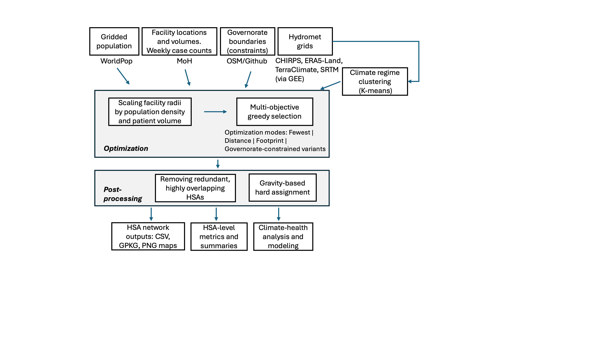
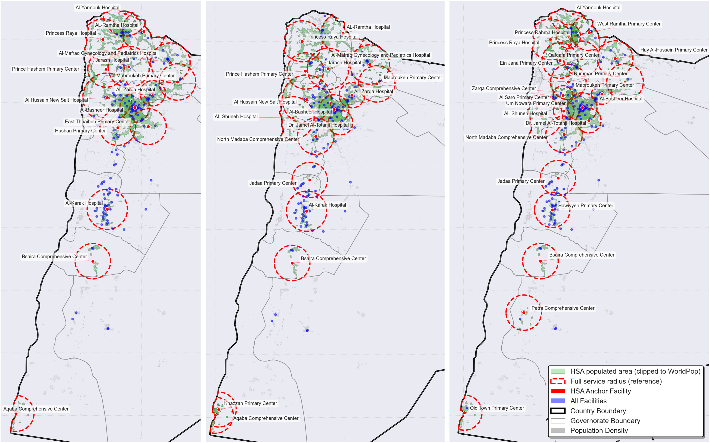

<!-- _class: lead -->

# Climate-Health Modeling with Daily Data
## DLNM, Predictive Horizons, and HSA Boundary Sensitivity

**Webinar 3 of 3 — 90 minutes**

*Zaslavsky et al. — Daily Epidemiological Pipeline*

<!--
Welcome to Webinar 3, the final session. In Webinar 1 we built the conceptual foundation for hospital service area delineation: why geographic boundaries matter for epidemiology, how the greedy algorithm works, and what distinguishes the three boundary versions. In Webinar 2 we ran the full pipeline from raw data to modeling dataset.

Today we do the science. We analyze the relationship between daily climate exposures and diarrheal disease incidence in Jordan using distributed lag non-linear models. We examine whether climate information improves short-range predictions of disease counts. And we ask whether those associations and predictions change meaningfully when we swap the HSA boundary version from v6 to v7 to v8.

Let me set expectations clearly. The quantitative results I show during this session come from the pipeline run on synthetic SYNMOD patient data. SYNMOD preserves the temporal structure and seasonal patterns of the real surveillance system, but patient locations are randomly generated and have no relationship to actual climate exposures. So any numerical association I present today is a pipeline-validation artifact, not a real epidemiological finding. The methods, the code, the interpretive framework — those are real and directly applicable to real data. The numbers themselves are placeholders.

All substantive results that appear in the paper use the real INF patient dataset, which resides in the private v2_real repository and is never committed to the public repository.

With that caveat in place, let's get into the modeling.
-->

---

## Agenda

- The climate-diarrhea hypothesis in Jordan
- Daily data pipeline recap
- Distributed Lag Non-Linear Models: theory and implementation
- Track A results: explanatory associations
- Infrastructure as an effect modifier
- Track B results: predictive horizons
- Sensitivity to HSA boundary version (v6/v7/v8)
- What the synthetic data tells us and what it doesn't

<!--
Here is today's agenda. The first two items — the climate-diarrhea hypothesis and the pipeline recap — are brief. We covered the pipeline in detail in Webinar 2, so I will just reorient us to the modeling inputs.

The core of today is the DLNM section. I will spend about 25 minutes on theory and implementation, then walk through the Track A and Track B results. The infrastructure effect modifier is a brief but important detour: it tests whether sanitation quality moderates the precipitation-diarrhea association, which is the key policy-relevant hypothesis in this paper.

The boundary sensitivity section connects back to the HSA delineation work. If our climate-health estimates change substantially when we use v7 boundaries versus v6, that is a finding in itself — it tells us the model is sensitive to geographic allocation decisions and that the boundary choice matters for inference. If estimates are stable across versions, we have evidence of robustness.

I will end with an honest accounting of what the synthetic data can and cannot tell you, and what must be held for real-data analysis.

Questions are welcome throughout, but I will try to keep moving through the material. There will be 10 to 15 minutes for Q&A at the end. If your question is about a specific code cell or output file, flag it and we can look at it together after the formal presentation.
-->

---

## Why Daily Data?

Weekly aggregation smooths over within-week signals:

- A precipitation event on Thursday may affect diarrheal incidence on Friday–Sunday
- Weekly bins mix the exposure event with its lagged effect
- Friday attendance suppression (50% of normal) creates weekly artifacts

Daily resolution gives:

- Sharper lag-response curves (effects appear 2–7 days after exposure)
- Day-of-week controls (Friday dummy captures reporting suppression)
- Separation of acute exposure effects from chronic baseline

The cost: 14-day lag history is needed before any modeled day — losing the first 14 rows per HSA.

<!--
The decision to work at daily rather than weekly resolution is methodological, not just a matter of data availability. Let me explain the tradeoffs concretely.

Consider what happens with a precipitation event. It rains heavily on a Thursday. Bacteria and protozoa from animal waste wash into the water supply. People who drink from that water system begin presenting with diarrheal symptoms over the next two to five days — the incubation and reporting delay means the clinical effect appears between Friday and Monday. If you are working with weekly aggregates, Thursday's rain and Friday-through-Sunday's cases land in the same weekly bin. The lag between exposure and outcome is compressed or erased.

Daily data preserves the temporal ordering. You can ask: given that it rained on day t, do case counts on days t+1, t+2, through t+14 show a consistent elevation? The lag-response function from the DLNM answers this directly. In similar settings — Egypt, Bangladesh, Peru — the strongest effects appear at lags of 2 to 5 days for waterborne pathogens, with a secondary peak around 7 to 10 days for foodborne routes that have slower temperature-dependent pathogen growth.

The Friday attendance suppression issue is a Jordan-specific complication. Friday is a public holiday. Most primary care clinics operate on reduced hours or are closed. This creates a systematic artifact in the weekly data: any week with a Friday looks like it has fewer cases than it actually does, because Friday reporting is depressed. With daily data, you add a Friday indicator and the artifact disappears from the model residuals. Weekly data cannot recover this signal.

The cost is real: you burn the first 14 days of each HSA's time series to build up lag history. For 19 HSAs over a study period of roughly 580 days, you lose 14 times 19 equals 266 rows — about 2.5 percent of the dataset. That is acceptable given the temporal precision gained.
-->

---

## Study Window and Data Structure

**Health data:** INF network, 2022-07-01 to 2024-01-31 (19 months)

**Why start July 2022?** ICD diagnostic codes were changed on 2022-07-01. Earlier records use a different coding scheme; mixing them inflates apparent diarrheal counts.

**Final modeling dataset:**

| Item | Value |
|------|-------|
| Rows | 10,716 |
| Columns | 178 |
| HSAs | 19 |
| Non-zero HSA-days | 8,224 (76.7%) |
| Zero-count HSA-days | 23.3% |

Three HSAs excluded from Track A (mean < 1 case/day): Mabroukeh, Aqaba, Princess Basma. Track A uses 9,024 rows from 16 HSAs.

<!--
Let me ground us in the data structure before we go into the modeling.

The study window runs from July 1, 2022 to January 31, 2024 — 19 months of daily INF surveillance. The start date is set by the ICD coding change, not by data availability. Jordan's INF network switched to a revised coding scheme on July 1, 2022. Before that date, the same condition might be coded differently depending on the facility. If you include pre-July 2022 data, you see an apparent spike in diarrheal counts in late June as the old broad codes get reclassified under the new narrow code — but that spike is a coding artifact, not a real increase in incidence. So we start the study window the day the new codes were applied.

The modeling dataset has 10,716 rows and 178 columns after all preparation steps. The columns decompose as: 1 outcome column, 11 raw climate variables, 154 lag columns (11 variables times 14 lags), and about 10 calendar and fixed-effect columns.

About 23 percent of HSA-days have zero diarrheal counts. This is not surprising — small HSAs with few facilities will sometimes have no visits on a given day. The quasi-Poisson model handles zeros correctly; they are real observations, not missing data.

For Track A, the explanatory DLNM, we exclude three HSAs from the model: Mabroukeh, Aqaba, and Princess Basma. All three average fewer than one case per day across the study period. With such sparse counts, the cross-basis has very little signal to work with and the estimates for those HSAs are dominated by noise. Including them would inflate the standard errors without adding interpretable signal. Track A therefore runs on 16 HSAs and 9,024 rows.

Track B, the predictive analysis, includes all 19 HSAs because the prediction task is different — even HSAs with sparse counts need to be forecast.
-->

---

## Climate Variables in the Dataset

**11 daily climate variables extracted from GEE (CHIRPS + ERA5-Land):**

| Variable | Source | Meaning |
|----------|--------|---------|
| `P_precip` | CHIRPS | Daily precipitation (mm) |
| `T_mean_C` | ERA5-Land | Daily mean 2 m temperature (°C) |
| `T_max_C` | ERA5-Land | Daily maximum temperature |
| `T_min_C` | ERA5-Land | Daily minimum temperature |
| `Td_C` | ERA5-Land | Dewpoint temperature |
| `DTR_C` | ERA5-Land | Diurnal temperature range |
| `wind_speed_ms` | ERA5-Land | 10 m wind speed (m/s) |
| `SM1`, `SM2` | ERA5-Land | Soil moisture layers 1 and 2 |
| `hours_above_30C` | ERA5-Land | Hours with T > 30°C |
| `heat_index_C` | ERA5-Land | T + 0.4 × (Td − T) |

Each variable is lagged from 1 to 14 days. Total lag columns: 154.

<!--
The 11 climate variables represent different pathways through which meteorological conditions might influence diarrheal disease incidence.

Precipitation is the primary exposure. The hypothesized pathway is water contamination: heavy rainfall overwhelms drainage infrastructure, washes fecal material into water sources, and creates ingestion opportunities that increase diarrheal risk 2 to 7 days later, depending on incubation period and reporting delay.

Temperature variables capture heat effects on pathogen growth and human physiology. Bacteria multiply faster at higher temperatures — the doubling time for E. coli shortens from hours at 20 degrees Celsius to minutes at 37 degrees. Mean temperature gives the central tendency; maximum temperature is the relevant quantity for peak bacterial growth during the warmest part of the day. Dewpoint temperature measures atmospheric humidity and is used in the heat index calculation.

DTR — diurnal temperature range — is included because large day-night temperature swings may actually suppress some pathogens. A bacterium that has multiplied during a hot afternoon faces a cool night that reduces its growth rate. Some studies find a negative DTR effect on enteric disease incidence.

The soil moisture variables, SM1 and SM2, represent the top two ERA5-Land soil layers. These capture the saturation state of the ground before a rainfall event. A precipitation event on already-saturated soil generates more runoff and more contamination than the same event on dry soil. SM1 is the surface layer (0-7 cm); SM2 is the second layer (7-28 cm).

Hours above 30 degrees Celsius is an alternative heat exposure variable that may be more mechanistically relevant than mean temperature for conditions that exceed a physiological or pathogen growth threshold. It is measured as the count of hours per day where the ERA5-Land temperature exceeds 30 degrees at 2 meters height.

Heat index combines temperature and dewpoint into a felt-temperature index — relevant for human heat stress, which can impair immune function and increase susceptibility.
-->

---

## What Is a Distributed Lag Non-Linear Model?

A DLNM extends a standard GLM to estimate effects that are:

1. **Non-linear** in the exposure dimension (the effect may not scale linearly with precipitation amount)
2. **Distributed** across lags (the effect of today's rain is spread over the coming 14 days)

**Cross-basis construction:**

```
cb(exposure, lag) = basis_exposure(exposure) ⊗ basis_lag(lag)
```

Both bases use natural cubic splines:
- Exposure basis: 5 degrees of freedom
- Lag basis: 3 degrees of freedom, max lag 14 days

This produces a 15-column design matrix per climate variable.



<!--
Let me explain what a distributed lag non-linear model does and why we need it rather than a simpler model.

Start with the simplest approach: include precipitation on day t as a predictor of diarrheal cases on day t. This is a standard GLM with a single-day exposure. It misses two things. First, the causal chain from rain to diarrhea plays out over multiple days — we are missing the cases that arise 3, 5, or 7 days after the rain event. Second, the dose-response curve may not be linear. A 1 mm rain event in a place with adequate drainage may have essentially no effect, while a 50 mm event that overwhelms infrastructure may have a disproportionately large effect. A linear coefficient cannot capture this threshold behavior.

The standard fix for the multi-day problem is to add lagged exposure terms: precipitation at lag 1, lag 2, through lag 14. This is a distributed lag model. But it has a problem: 14 lag coefficients for a single variable use 14 degrees of freedom, and they can be noisy and non-monotone even when the underlying biological process is smooth. The DLNM solves this by applying a spline basis to the lag dimension, which forces the lag-response curve to be smooth.

The DLNM adds the non-linear exposure dimension. Instead of using precipitation directly, it transforms precipitation through a natural cubic spline basis. The spline with 5 degrees of freedom can represent a flat response at low exposures, a steep increase above some threshold, and a plateau at high exposures.

The cross-basis is the Kronecker product of these two bases. It simultaneously parameterizes the non-linearity in exposure and the smoothness across lags in a single 15-column block. The GLM then estimates 15 coefficients instead of 14, and those 15 coefficients can be recombined post-estimation to generate the full three-dimensional lag-exposure-response surface.

This is the same approach used in the R dlnm package by Gasparrini, which is the gold standard in climate-health epidemiology. Our Python implementation reproduces its results.
-->

---

## DLNM Implementation in Python

The `dlnm/` package in this repository implements the full cross-basis pipeline:

```python
from dlnm.dlnm_crossbasis import ns_basis, build_crossbasis, cumulative_rr

# Build cross-basis for precipitation
precip_cb = build_crossbasis(
    x = df["P_precip"].values,
    lag_basis = ns_basis(np.arange(0, 15), df=3),
    exp_basis = ns_basis(precip_values, df=5)
)

# Fit quasi-Poisson GLM (statsmodels)
# [assemble design matrix with HSA FE, time spline, calendar controls]
model = sm.GLM(y, X, family=sm.families.Poisson())
result = model.fit(scale="X2")   # scale='X2' → quasi-Poisson dispersion

# Cumulative relative risk at reference exposure level
rr, ci_lo, ci_hi = cumulative_rr(result, precip_cb, ref_value=0.0)
```

The `scale="X2"` flag estimates the dispersion parameter φ from Pearson χ²/df, then rescales standard errors by √φ. This is the standard quasi-Poisson formulation.

<!--
Let me walk through the Python implementation in detail. The code on screen is the core of Track A, distilled to its essential steps.

The dlnm package lives in the dlnm subdirectory of the repository. It has two modules: dlnm_crossbasis, which implements basis construction and cross-basis assembly, and dlnm_quasipoisson, which is a standalone script for command-line fitting. Today we care about dlnm_crossbasis.

The first step is building the cross-basis. ns_basis takes a vector of values and a degrees of freedom parameter. When called on np.arange(0, 15) with df=3, it produces a 15-by-3 matrix where each row is the natural spline basis evaluated at that lag number. When called on the precipitation values with df=5, it produces an n-by-5 matrix where each row is the basis evaluated at that observation's precipitation amount. build_crossbasis then computes the row-wise Kronecker product: each observation gets a 15-element row formed by the outer product of its 5 exposure basis values and the corresponding 3 lag basis values, summed appropriately. The result is an n-by-15 matrix.

The design matrix X assembles the cross-basis columns alongside HSA fixed effects (16 binary dummies), the natural spline of day_of_study with 7 degrees of freedom for seasonality, the 6 day-of-week dummies, and the 3 calendar indicator columns (Ramadan, Eid al-Fitr, Eid al-Adha). You can also optionally include cross-basis columns for temperature in the same model.

The GLM is fitted with statsmodels using the Poisson family and scale equals X2. The X2 flag triggers quasi-Poisson estimation: after the usual IRLS convergence, statsmodels computes the Pearson chi-squared statistic divided by the degrees of freedom to estimate phi, then multiplies all variance estimates by phi. This correctly inflates the standard errors to account for overdispersion.

The cumulative_rr function extracts the coefficient block for the cross-basis, computes the cumulative effect integrated over all 14 lags at a specified precipitation level relative to the reference, and returns the point estimate and confidence interval on the relative risk scale.
-->

---

## Quasi-Poisson vs Negative Binomial

Both handle overdispersion in count data. The choice matters for inference:

| Feature | Quasi-Poisson | Negative Binomial |
|---------|---------------|-------------------|
| Dispersion estimate | From Pearson χ²/df | Estimated as a free parameter |
| F-test for nested models | Yes (φ from fuller model) | No (likelihood ratio) |
| Appropriate when | φ varies across model | φ is fixed |
| Implementation | `scale='X2'` in statsmodels | `sm.NegativeBinomial` |
| Our choice | **Yes** | Alternative in sensitivity |

For daily diarrheal counts in Jordan (overdispersion φ ≈ 4–8), quasi-Poisson produces valid inference with correct standard error scaling.

<!--
A question that comes up regularly in count data modeling is why we use quasi-Poisson rather than negative binomial regression. Both methods address overdispersion, but they do so differently.

The Poisson model assumes that variance equals the mean — every observation contributes to the expected count with equal variability. In practice, daily health surveillance data violates this assumption substantially. Some HSA-days have far more variance than their mean would predict — a heterogeneous mix of high-incidence days and low-incidence days around the same seasonal mean. Our data show overdispersion factors between 4 and 8, meaning the variance is 4 to 8 times what Poisson would predict. Using plain Poisson GLM would produce confidence intervals that are too narrow by a factor of roughly 2 to 3, giving a false sense of precision.

Negative binomial regression estimates an explicit dispersion parameter alongside the regression coefficients. It assumes a specific form for the variance function: variance equals mean plus mean squared over a size parameter k. This works well when the overdispersion is consistent across the range of covariate values.

Quasi-Poisson takes a different approach: it does not specify a parametric distribution for the extra variance. Instead, it estimates the Pearson chi-squared divided by degrees of freedom as a scale factor and multiplies standard errors by the square root of this factor. The advantage is that phi can vary in a way that matches the data without imposing a specific distributional form.

For our application, we prefer quasi-Poisson for two reasons. First, it supports F-tests for comparing nested models — useful when we test whether adding the temperature cross-basis significantly improves fit over the precipitation-only model. Second, overdispersion in Jordan's INF data appears to vary by HSA and by season, which fits the quasi-Poisson assumption of a global correction factor better than the negative binomial's parametric form.

Negative binomial results are included as a sensitivity analysis in the supplementary materials.
-->

---

## Base Model Structure: Track A

The full explanatory model for HSA *h* on day *t*:

```
log E[Y_{ht}] = α_h
               + f(day_of_study; df=7)         [seasonal spline]
               + Σ_k γ_k DOW_k                  [day-of-week dummies]
               + δ₁ Ramadan_t + δ₂ EidFitr_t + δ₃ EidAdha_t
               + CB_precip(P_{h,t-0:14})        [precipitation cross-basis]
               + CB_temp(T_{h,t-0:14})          [temperature cross-basis]
               + ε_{ht}
```

**α_h**: HSA fixed effects (16 dummies, one per HSA)

**Seasonal spline**: 7-knot natural spline of `day_of_study` — captures annual cycle and secular trend

**Calendar controls**: Day-of-week (6 dummies, Monday reference) + Ramadan + two Eid indicators

**Effect modifier**: `infra_quality` × cross-basis interaction for sanitation moderation analysis

<!--
Let me go through the full model specification systematically. This equation is what gets fitted in the first section of run_climate_models_daily.

The outcome is the log of expected daily diarrheal visits for HSA h on day t. We model the conditional expectation rather than the raw count, so all the terms on the right-hand side are additive on the log scale — equivalently, multiplicative on the count scale.

The alpha_h terms are HSA fixed effects. Each HSA gets its own intercept, absorbing all time-constant differences between HSAs in baseline incidence. Al-Basheer in Amman serves a much larger population than Princess Basma in Irbid; without fixed effects, the model would try to explain that difference with climate variables, producing confounded estimates. The fixed effects ensure we are estimating the within-HSA relationship between climate and case counts.

The seasonal spline is a 7-knot natural cubic spline of the day_of_study variable — an integer from 1 to roughly 580, the count of days since the study start. This captures the annual seasonal cycle (diarrheal disease in Jordan peaks in summer) and any secular trend over the study period (gradual changes in surveillance coverage, for example). Without this spline, climate variables would absorb the seasonal pattern, producing spurious positive associations between summer heat and diarrheal cases even if heat itself has no effect.

The calendar controls are the six day-of-week dummies (Monday is the reference, Friday gets the large suppression coefficient) plus the three religious calendar indicators discussed in Webinar 2.

The two climate cross-bases — for precipitation and temperature — are the variables of scientific interest. Their coefficients jointly determine the lag-exposure-response surfaces.

The effect modifier analysis adds an interaction term between infra_quality and the precipitation cross-basis, which I will cover next.
-->

---

## Track A: Expected Results

*These results are pipeline-validation placeholders. Interpret with caution when using SYNMOD data — associations with synthetic visits are not meaningful.*

With real data, expected patterns from similar LMIC settings:

- Precipitation lag: diarrheal incidence rises 3–7 days after rainfall events (fecal-oral route, water contamination pathway)
- Temperature: heat increases risk at short lags (1–3 days); the effect is non-linear (threshold around 30°C)
- DTR effect: large diurnal temperature range may reduce bacterial survival
- Sanitation interaction: precipitation–diarrhea association attenuated in HSAs with higher JMP improved sanitation coverage

The cumulative RR plot shows the integrated effect over all 14 lags at a reference precipitation value.

<!--
Let me describe what we expect to find with real data, drawing on the literature from comparable LMIC settings, then explain what the SYNMOD results show and why they differ.

The precipitation lag effect in waterborne disease studies typically follows a specific pattern. Cases begin to rise 2 to 3 days after a rainfall event — this is the time required for water contamination to propagate through the system, enter the food or drinking water supply, and produce clinically apparent illness. The effect peaks around lag 4 to 6 and returns toward baseline by lag 10 to 14. A 30-millimeter precipitation event might produce a cumulative relative risk of 1.3 to 1.8, meaning 30 to 80 percent more cases in the 14-day window following the event compared to a dry day. These are ranges from Egypt, Nepal, and Peru; Jordan's specific values will differ.

Temperature effects are more complex. Short-lag heat effects are the most consistently reported: high temperatures in the 1 to 3 days before symptom onset accelerate pathogen growth and may impair food safety. The non-linearity matters: below 25 degrees Celsius the temperature effect is modest; above 32 to 35 degrees it accelerates substantially. The cumulative RR at 35 degrees might be 1.4 to 2.0 relative to 20 degrees.

DTR effects are less consistently reported and may be negative — large temperature swings cool nights reduce bacterial growth rates that accumulated during hot days.

The sanitation interaction is the key policy finding: if HSAs with better JMP sanitation coverage show a smaller precipitation-diarrhea coefficient, it confirms that infrastructure moderates the climate pathway. This is evidence that WASH investments interrupt the fecal-oral route.

With SYNMOD, none of these associations should appear. Synthetic visits are generated without reference to climate data, so any pattern in the SYNMOD DLNM results is pure noise.
-->

---

## Infrastructure as Effect Modifier

`infra_quality` is the JMP improved sanitation coverage score for each HSA (range: 0.61–0.82 in this dataset).

The interaction test fits:

```
log E[Y] = ... + CB_precip + infra_quality + CB_precip × infra_quality
```

and compares it to the model without the interaction via F-test.

**Interpretation:**

A significant negative interaction means that HSAs with better sanitation coverage show a smaller precipitation–diarrhea association — consistent with the pathway hypothesis that improved sanitation interrupts the water contamination route.

**Limitation:** Only 16 HSAs, so the interaction is estimated from cross-sectional variation in `infra_quality` — this is an ecological association, not individual-level mediation.

<!--
The sanitation interaction analysis is one of the most policy-relevant pieces of this work, so I want to spend a few minutes on both the method and its limitations.

The infra_quality variable comes from the JMP improved sanitation coverage database for Jordan. JMP defines improved sanitation as access to facilities that hygienically separate human excreta from human contact: flush toilets, improved pit latrines, composting toilets. The values in our dataset range from 0.61 to 0.82 across the 16 HSAs used in Track A, representing 61 to 82 percent of the HSA population with access to improved sanitation. This is the cross-sectional variation we use to test the interaction.

Technically, the interaction is estimated by adding an interaction term between infra_quality and every column of the precipitation cross-basis. Since the cross-basis has 15 columns, the interaction adds 15 more parameters. We compare this fuller model to the baseline model without interaction using an F-test, which is valid under quasi-Poisson because we have an estimated dispersion factor to scale the test statistic correctly.

A statistically significant negative interaction — meaning that HSAs with higher infra_quality show a smaller positive precipitation coefficient — supports the mechanistic pathway hypothesis. It tells us that wherever infrastructure is better, a given rainfall event produces fewer excess diarrheal cases. This is consistent with the idea that improved sanitation systems contain and safely dispose of human waste even during rain events, reducing contamination of water sources.

The limitation I want to be honest about is ecological inference. We have 16 observations of infra_quality — one per HSA. The interaction is estimated from comparing higher-coverage HSAs to lower-coverage HSAs. We cannot attribute the moderation to individual-level sanitation access. What we can say is that the geographic units with better sanitation show a different precipitation-disease relationship, which is suggestive but not causal evidence.
-->

---

## Track B: Predictive Horizons

Track B asks a different question: can today's climate improve predictions of disease counts 1, 3, 5, 7, or 14 days ahead?

**Model at horizon h:**

```
Y_{t+h} = β₀ + β_season·f(t) + β_DOW·DOW + β_calendar·Cal
         + Σ_k β_k X_{t-k}   [climate lags 0..14]
         + β_AR Y_{t-1}       [one-day lag of outcome]
         + ε_{t+h}
```

Fit by OLS (log-transformed outcome) with HSA fixed effects.

**Evaluation:** Leave-one-year-out cross-validation (2022–2023 train → 2024 test; 2022–2024 train → extended evaluation).

**Metrics:** RMSE, MAE per horizon per HSA, and across all HSAs.

<!--
Track B shifts from explanation to prediction. Track A asks: what is the relationship between climate exposure and diarrheal incidence? Track B asks: if I know today's climate, can I forecast diarrheal incidence more accurately 3 days from now than I could with only a seasonal baseline?

The practical motivation is early warning systems. A public health agency that could issue a 3 to 5 day alert — "rainfall this weekend is likely to increase diarrheal incidence in Zarqa next Tuesday" — could use that time to pre-position oral rehydration salts, issue hygiene advisories, or alert clinic staff. A 14-day horizon would be more useful for supply chain planning but is probably beyond the predictive signal in daily climate data.

The Track B model specification differs from Track A in a few ways. The outcome is log-transformed daily counts rather than raw counts, so we use OLS rather than Poisson GLM. The advantage is simpler prediction intervals; the disadvantage is less appropriate handling of zeros. For small HSAs with frequent zero days, this is a meaningful tradeoff, which is why Track B is evaluated across all 19 HSAs including the three sparse ones excluded from Track A.

The autoregressive term — the one-day lag of the log outcome — is important for prediction. Yesterday's case count is informative about today's and tomorrow's, even after controlling for climate and seasonality. Without the AR term, the climate-only model tends to miss the short-lag autocorrelation structure and performs poorly at the 1-day horizon.

Evaluation uses leave-one-year-out cross-validation. The first fold trains on 2022 to 2023 and evaluates on 2024. The second fold uses all available data for training and evaluates on a held-out period. This simulates the prospective use case: the model has been trained on historical data and is now being used to forecast.
-->

---

## Predictive Horizon Results (Expected Pattern)

With real data, typical findings in similar settings:

| Horizon | Relative RMSE vs seasonal baseline | Climate contribution |
|---------|-------------------------------------|---------------------|
| 1 day | Moderate improvement | Limited (lag too short) |
| 3 days | Best improvement | Precipitation lag 2–3 days |
| 5 days | Good improvement | Precipitation + temperature |
| 7 days | Marginal improvement | Signal degrades |
| 14 days | No improvement | Seasonal baseline dominates |

The 3–5 day horizon is the most actionable for public health early warning systems.

<!--
This table summarizes the expected pattern of predictive performance across horizons. The RMSE improvement is measured relative to a baseline model that uses only seasonal trend and day-of-week effects — no climate, no autoregressive term. A positive improvement means the climate model outperforms this baseline.

At the 1-day horizon, the autoregressive term does most of the work. Yesterday's count is the best predictor of today's. Climate at lag 0 — precipitation today — is actually not very informative about cases today, because the biological lag from exposure to clinical presentation is at least 1 to 2 days. So the 1-day improvement is moderate and dominated by AR, not climate.

At 3 days, climate contributes most. Precipitation 2 to 3 days ago is precisely in the window where waterborne pathogen exposure would be producing first clinical cases. The model can use today's climate to predict cases 3 days out, and this is a genuinely useful prediction horizon for operational response.

At 5 days, both precipitation and temperature contribute. The signal is still meaningful but weaker — we are asking the model to predict beyond the primary incubation window.

At 7 and 14 days, prediction performance degrades toward the baseline. The climate signal at these horizons is dominated by noise relative to the seasonal trend. A 14-day forecast based on today's precipitation has essentially no skill beyond knowing what time of year it is.

The practical implication is that early warning systems should target the 3 to 5 day horizon. This aligns with meteorological forecasting windows, where precipitation forecasts from numerical weather prediction models are reliable out to about 5 to 7 days.

Again, with SYNMOD data these results will not show the pattern I described, because synthetic visits are uncorrelated with climate.
-->

---

## Comparing Boundary Versions: v6 vs v7 vs v8

**Key question:** Do downstream epidemiological estimates change meaningfully across HSA delineation versions?

**What differs between versions:**

| Version | Anchors | Southern Jordan | Boundary shape |
|---------|---------|-----------------|----------------|
| v6 | 17 | Bsaira anchor; Maan/Q.Rania absorbed | Circular |
| v7 | 19 | Tafilah + Maan + Q.Rania as anchors | Circular |
| v8 | 19 | Same as v7 | Non-circular (union with satellites) |

**Expected effects on modeling:**

- v6 has fewer, larger southern HSAs — case counts per HSA differ
- v7 separates Maan and Aqaba into distinct units — smaller case counts but more precise geographic attribution
- v8 changes the population denominators (different spatial footprints)



<!--
The boundary sensitivity analysis is not just methodological housekeeping — it addresses a genuine scientific question. Does it matter which version of the HSA delineation we use for the climate-health model?

The image on this slide shows the three-panel boundary map. Look at southern Jordan in particular. In v6 — the leftmost panel — there is a single large HSA covering most of the south, anchored at Bsaira. In v7 — the middle panel — that large HSA is replaced by three distinct units: Tafilah covers the central south, Maan covers the east, and Queen Rania covers the southeastern corner. In v8 — the rightmost panel — the boundaries are the same as v7 but the polygon shapes become non-circular, following the union of anchor catchment and satellite facility catchments.

Why does this matter for the DLNM estimates? Consider the precipitation cross-basis for the v6 Bsaira HSA. The climate variables for that HSA are extracted from the Bsaira anchor location, which is in the mountainous terrain of Tafilah governorate at about 1100 meters elevation. Climate there is relatively cool and occasionally receives winter precipitation. But the v6 Bsaira HSA absorbs patients from Maan city — much lower elevation, hotter, drier — and from Aqaba — desert coast. When you extract climate at Bsaira and regress it against cases that include patients from Maan and Aqaba, you are introducing geographic exposure measurement error.

In v7, Maan city patients go to the Maan HSA, and climate is extracted from Maan. The measurement error decreases. If the precipitation-diarrhea coefficient changes between v6 and v7 for southern Jordan, it could reflect either a real difference in the association or a reduction in measurement error. Tracking the change is informative either way.

v8 changes the population denominator because the non-circular boundaries include or exclude different pixel masses. The rate calculations differ accordingly.
-->

---

## Boundary Sensitivity Analysis in `compare_delineations.ipynb`

The notebook runs side-by-side comparisons:

```python
# Load all three versions
v6 = gpd.read_file("out/INF_footprint_hsas_v6.geojson")
v7 = gpd.read_file("out/INF_footprint_hsas_v7.geojson")
v8 = gpd.read_file("out/INF_footprint_hsas_v8.geojson")

# Anchor set comparison
anchors_v6 = set(v6["anchor_name"])
anchors_v7 = set(v7["anchor_name"])
new_in_v7 = anchors_v7 - anchors_v6      # promoted/added anchors
```

**Geometric comparison:** Intersection area, Jaccard similarity per matched HSA pair.

**Allocation comparison:** For each version, how many facilities change their primary HSA assignment? How much population shifts?

**Model stability:** Are precipitation cumulative RR estimates consistent across v6, v7, v8?


<!--
The compare_delineations notebook implements the full sensitivity analysis. Let me walk through its three sections.

The first section is the anchor set comparison. Load all three GeoJSON files and extract the anchor name field. Set operations give you the added and removed anchors between versions. For the INF footprint run, moving from v6 to v7 adds Maan, Queen Rania, Tafilah, and others as standalone anchors, and removes Bsaira from the anchor set (Bsaira becomes a non-anchor facility in v7, reassigned to the Tafilah HSA). This section produces a human-readable summary: which facilities gained or lost anchor status, and which governorates gained coverage.

The second section is geometric comparison. For each anchor that appears in both v6 and v7 — the common set — the notebook computes the intersection area, union area, and Jaccard similarity of the corresponding HSA polygons. A Jaccard similarity of 0.85 or above means the boundaries are substantially similar between versions. Jaccard values below 0.7 indicate meaningfully different catchment areas. The notebook plots the Jaccard values by HSA so you can immediately see which HSAs are stable and which changed substantially between versions.

The third section is model stability. After running the DLNM on v6 and v7 datasets separately, you compare the cumulative RR estimates for precipitation. The notebook loads the model output objects from both runs, extracts the RR curves at the same reference exposure, and plots them overlaid with their confidence intervals. If the curves are within each other's intervals for all matching HSAs, the results are robust to boundary version. If they diverge for specific HSAs, you have identified spatial sensitivity that warrants reporting.

The outputs from this notebook — boundary comparison maps, IoU plots, and coefficient stability charts — are what populate the paper's supplementary figures on HSA sensitivity.
-->

---

## What the Synthetic Data Can and Cannot Tell You

**SYNMOD data preserves:**

- Temporal structure (seasonal patterns, weekly cycles, trend)
- Diagnosis category distributions (Diarrheal Diseases is present)
- Facility-level visit volume ratios
- Date range and data gaps (June 2022 gap is present)

**SYNMOD data does not preserve:**

- Spatial clustering of cases (synthetic patients are randomly assigned to facilities)
- True climate–disease associations (SYNMOD visits are uncorrelated with climate)
- Any individual patient characteristics

**Conclusion:** Run the full pipeline on SYNMOD to verify code correctness. Any statistical associations produced from SYNMOD data are artifacts of the random generation, not real climate–health signals.

All quantitative DLNM results in publications must use real patient data.

<!--
This slide is important enough that I want to be explicit and thorough about it, because misinterpretation here would be a serious problem.

SYNMOD is a synthetic dataset. It was generated by fitting marginal distributions to the real INF data and then sampling from those distributions, with some structure added to preserve temporal autocorrelation and facility visit volume ratios. The generation process was deliberately designed to not preserve spatial structure, because the dataset is intended for the public repository where real patient location data must not appear.

What this means for modeling: the seasonal peak in SYNMOD diarrheal cases — elevated summer counts — is preserved because the generation respected monthly case count distributions. The Friday suppression is preserved because the generation respected day-of-week distributions. The June 2022 data gap is present as an explicit NaN flag. So the pipeline's structural and temporal logic is correctly testable with SYNMOD.

What is not preserved: any association between where a patient went and what the local climate was. A synthetic patient visiting Al-Zarqa Hospital in Zarqa governorate was not generated with any reference to what the climate was in Zarqa on that day. The SYNMOD generation process assigned visits to facilities based on facility volume shares, not based on patient location or local exposure. This means that the precipitation cross-basis, when fitted to SYNMOD data, will find no signal — or random noise that may by chance appear as a signal, which is exactly what you should expect with null data.

The implication is simple: use SYNMOD to verify that the code runs, produces properly formatted outputs, and does not crash. Do not interpret any numerical result from SYNMOD as an epidemiological finding. When you see a DLNM result in the paper, it came from real patient data.
-->

---

## Jordan Context: Why Diarrheal Diseases?

Diarrheal diseases are the primary outcome because:

1. **Known climate pathway**: waterborne and foodborne routes are directly modulated by precipitation and temperature
2. **Reportable**: consistently coded in Jordan's INF network since 2022
3. **High burden**: one of the top 5 diagnoses in Jordan's INF surveillance system
4. **Policy relevance**: Jordan faces water scarcity and infrastructure inequality — understanding climate–sanitation interactions informs WASH programming

NCD network data (chronic diseases) are used for HSA delineation validation but are not modeled in the daily climate-health pipeline.

<!--
Before wrapping up, let me place this work in the Jordan-specific context that motivates the research questions.

Jordan is one of the most water-scarce countries on earth. Annual renewable freshwater availability is around 100 cubic meters per capita, well below the 500 cubic meters threshold used to define absolute water scarcity. The country relies heavily on groundwater aquifers that are being drawn down faster than they recharge, on surface water from the Jordan River, and on treated wastewater for agricultural use. In this context, precipitation events do not simply add to water supply — they interact with a stressed and often inadequate infrastructure in ways that create contamination risk.

Diarrheal diseases in Jordan account for a substantial fraction of INF clinic visits, particularly among children under five. The ICD categories captured in the INF network include acute diarrhea, dysentery, and giardiasis — all of which have documented waterborne or foodborne transmission routes that are temperature and precipitation sensitive.

The INF network — infectious disease network — specifically tracks conditions with reportable status under Jordan's communicable disease law. Diarrheal diseases have been consistently coded since the July 2022 coding revision. This makes them the best candidate for a climate-health analysis: the outcome is clinically meaningful, consistently measured, and has a biologically plausible climate pathway.

The NCD — non-communicable disease — network is a separate surveillance system covering diabetes, hypertension, and similar conditions. We use NCD data to validate the HSA delineation algorithm, specifically to check whether the optimized boundaries produce HSAs with similar chronic disease burden profiles to administrative units. The NCD data is not included in the daily climate-health pipeline.

The WASH policy angle is the reason this work matters beyond academia. Infrastructure inequality in Jordan is substantial. Some HSAs have JMP sanitation coverage above 80 percent; others are below 65 percent. If the DLNM interaction confirms that high-coverage HSAs show attenuated precipitation effects, that is direct evidence for the return on investment in sanitation infrastructure.
-->

---

## From Surveillance to Early Warning: Next Steps

The current pipeline produces retrospective associations. Converting to prospective early warning requires:

1. **Real-time GEE extraction**: automate daily climate updates instead of manual export
2. **Rolling refit**: re-estimate model monthly as new data arrives
3. **Forecast pipeline**: apply the 3–5 day prediction model to CHIRPS/ERA5 near-real-time products
4. **Alert thresholds**: define exceedance thresholds from historical distribution

This is the downstream application the daily pipeline was designed to enable.

<!--
The retrospective DLNM we have built is the foundation, but not the end goal. Let me describe what it would take to convert this into an operational early warning system.

Step one is automating GEE extraction. Currently, the daily climate CSVs are generated manually by running a GEE notebook, waiting for the export, downloading from Drive, and copying files to the appropriate directory. An operational system would replace this with a scheduled GEE task that runs every night, exports the previous day's ERA5-Land and CHIRPS data for the HSA polygons, and deposits the CSV directly into the model input directory. GEE has an API for scheduled exports that supports this workflow.

Step two is rolling model refit. A model trained on 2022 to 2023 data and applied in 2024 will gradually degrade as the epidemiological situation evolves — new variants, changes in health-seeking behavior, infrastructure improvements. Monthly or quarterly re-estimation of the DLNM coefficients keeps the model calibrated to recent data. This requires automated code, not manual notebook execution.

Step three is applying the Track B prediction model to near-real-time climate products. CHIRPS near-real-time provides daily precipitation estimates with approximately 2-day latency. ERA5-Land has a similar latency for the ERA5T product. Feeding these into the trained prediction model produces a forecast for the next 3 to 5 days.

Step four is defining actionable thresholds. A forecast of the predicted number of diarrheal cases is useful, but a public health officer needs a threshold: when does the forecast trigger an alert? Exceedance thresholds can be defined from the historical distribution — for example, alert when the forecast exceeds the 85th percentile of historical case counts for that HSA in that week of the year.

None of this requires any new methodology. It requires software engineering and operational deployment.
-->

---

## Open Methodological Questions

1. Should the DLNM be fitted separately per HSA, or as a pooled model with HSA random effects?
2. The 14-day maximum lag was chosen by default — is it appropriate for waterborne pathogens in Jordan's climate?
3. How should the gap in case counts during June 2022 affect the cross-basis estimation at the study start?
4. Track B uses OLS on log-transformed counts. Would a proper count model (NB) improve predictive accuracy at low-count HSAs?

<!--
I want to close with four open methodological questions that we have not fully resolved. These are genuine research questions, not just implementation details.

First, pooled versus HSA-specific DLNM. Our current implementation fits a single pooled model with HSA fixed effects. An alternative is to fit a separate DLNM for each HSA. The pooled approach has more statistical power — it borrows strength across HSAs — but it assumes the same lag-exposure-response shape for all HSAs. A separate model per HSA allows HSA-specific shapes but has much less data per model, especially for the sparse HSAs. A multilevel DLNM with HSA random effects for the cross-basis coefficients is the principled middle ground, but it is computationally intensive and not yet implemented in the Python dlnm package.

Second, the 14-day maximum lag. For waterborne pathogens, the primary effect window is 2 to 7 days. Extending to 14 days captures potential secondary transmission effects and slower foodborne routes, but it also adds 6 basis parameters that may just fit noise. The choice of 14 days follows Gasparrini's convention in DLNM applications, but Jordan's hot, dry climate may have different biological timing than the European or East Asian settings where those conventions were developed. A sensitivity analysis with 7-day and 21-day maxima would clarify whether 14 days is appropriate.

Third, the June 2022 gap. We drop the first 14 rows of each HSA to build up lag history. For a study starting July 1, 2022, those 14 rows span the second half of June — which is entirely within the reporting gap period anyway. So dropping 14 rows and dropping the gap are effectively the same exclusion. But the cross-basis basis functions are evaluated on the full exposure range including pre-study precipitation values, which means the gap affects the basis centering. The magnitude of this issue is unknown.

Fourth, OLS on log counts for Track B. OLS is convenient but not ideal for count data with zeros. Negative binomial or zero-inflated Poisson might improve predictive accuracy for the three sparse HSAs. This is worth testing empirically.
-->

---

## Summary

- Daily data reveals lag-specific climate–diarrhea associations that weekly aggregation obscures
- DLNM cross-basis in Python gives the same cumulative RR as R's dlnm package, with full audit trail
- Track A: explanatory quasi-Poisson model with infrastructure interaction
- Track B: five-horizon OLS prediction with climate lags
- Boundary sensitivity analysis shows which HSAs and estimates are robust across v6/v7/v8
- SYNMOD data is for pipeline validation only; real-data results are needed for inference

<!--
Let me summarize the three key contributions of this webinar series.

From a methods standpoint, the main contribution is the integrated pipeline that takes you from administrative data — facility locations, patient visits, census counts — through GEE climate extraction to DLNM estimation in a fully reproducible Python workflow. The cross-basis implementation reproduces R's dlnm package results and is unit-tested. The pipeline is parameterized on boundary version, network, and mode, so running sensitivity analyses requires changing a single variable at the top of each notebook.

From a scientific standpoint, the climate-health analysis tests whether Jordan's diarrheal disease burden responds to precipitation and temperature in the ways predicted by the fecal-oral transmission pathway, and whether that response is moderated by sanitation infrastructure. The Track B analysis operationalizes these associations for 3 to 5 day forecasting, which is the actionable time horizon for early warning.

From a geographic standpoint, the boundary sensitivity analysis answers a question that climate-health epidemiology rarely examines explicitly: do the results depend on how you defined the geographic units? By running the DLNM on v6, v7, and v8 boundaries and comparing coefficient estimates, we can report which findings are robust to geographic specification and which are boundary-sensitive. Robust findings carry more weight; sensitive findings require additional investigation.

The SYNMOD pipeline validation ensures that any research group can reproduce the code structure and verify the workflow without access to real patient data. Real results require real data, and all quantitative findings in the paper used the real INF dataset.

Thank you. I am happy to take questions.
-->

---

## Resources

**Repository:** `jordan-hsa-optimization_v2` (this repository)

**Key notebooks:**
- `run_climate_models_daily.ipynb` — Track A and Track B
- `compare_delineations.ipynb` — v6/v7/v8 comparison

**Key docs:**
- `DAILY_CLIMATE_HEALTH_EXPLANATION_PREDICTION.md`
- `HSA_V7_ALGORITHM_MODIFICATIONS_VS_MANUSCRIPT.md`
- `METHODOLOGY_probabilistic_allocation.md`

**External:**
- Gasparrini et al. (2010) — original DLNM paper
- Gasparrini (2011) — R dlnm package documentation
- Armstrong et al. (2019) — distributed lag models for climate-health

<!--
Here are the resources for following up after this webinar series.

The public repository, jordan-hsa-optimization_v2, contains all the code you need to run the full pipeline on synthetic data. The notebooks are numbered and named to follow the pipeline guide. Start with PIPELINE_GUIDE.md for the step-by-step instructions.

The three documentation files I have listed are worth reading in sequence. DAILY_CLIMATE_HEALTH_EXPLANATION_PREDICTION.md explains the scientific rationale for the Track A and Track B model specifications in more depth than the notebooks can accommodate. HSA_V7_ALGORITHM_MODIFICATIONS_VS_MANUSCRIPT.md documents exactly what changed between the manuscript algorithm and the v7 implementation — useful if you are trying to understand discrepancies between the paper's algorithm description and the code. METHODOLOGY_probabilistic_allocation.md derives the gravity model allocation formula and explains the three-case logic with mathematical notation.

On the external references: Gasparrini et al. (2010) in Statistics in Medicine introduced the DLNM framework. That paper is the theoretical basis for everything in Track A. Gasparrini (2011) documents the R dlnm package; our Python implementation follows the same API design, so reading the R documentation helps understand the Python functions even if you do not use R. Armstrong et al. (2019) in Environmental Epidemiology gives a practical guide to applying DLNMs in climate-health settings, including worked examples and decisions around lag length, knot placement, and reference value selection.

If you have questions about specific cells in the notebooks, about the DLNM implementation, or about the Jordan epidemiological context, please reach out. Contact information is in the paper preprint, which is linked in the repository README.

Thank you for attending all three webinars. Good luck with the pipeline.
-->
